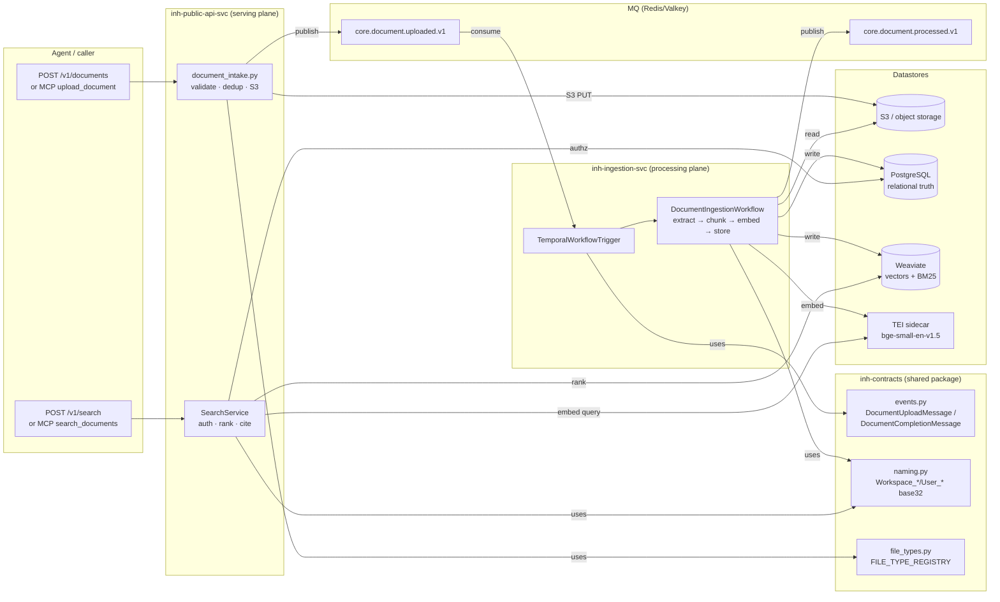
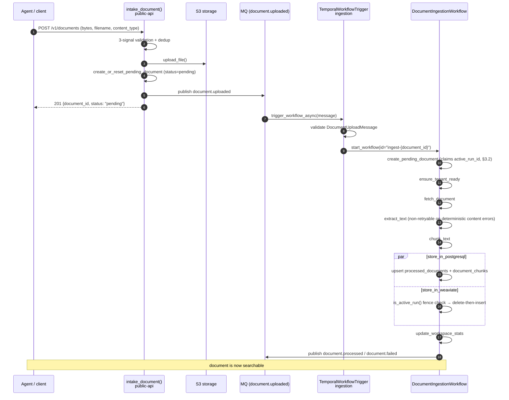
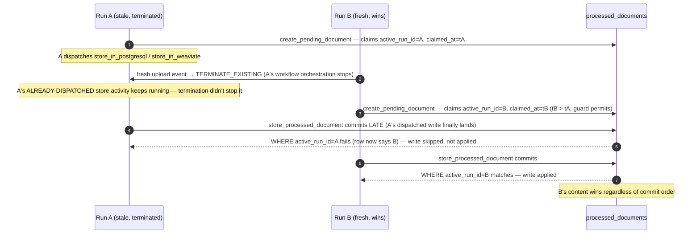

# Architecture — how the stack works, end to end

This page traces one document from `POST /v1/documents` to a cited chunk in
a `POST /v1/search` response, and explains why the system is shaped the way
it is. It is the connective tissue between pages that already cover their
own layer in depth — it links to those rather than repeating them (see
[What this page does not repeat](#what-this-page-does-not-repeat)).

Every claim below is grounded in a specific file. Where the codebase itself
doesn't yet answer a question, that is stated rather than guessed.

## 1. Two services, one shared contract

| Service | Owns | Does not own |
| --- | --- | --- |
| `services/inh-ingestion-svc` | Temporal workflows: extract, chunk, embed, write to PostgreSQL + Weaviate | Auth, search ranking, citations |
| `services/inh-public-api-svc` | REST + MCP: auth, search, citations, evals, chunk edits | Extraction, chunking, embedding generation |
| `services/inh-contracts` | The shared package both import: MQ event schemas (`events.py`), Weaviate naming (`naming.py`), the file-type registry (`file_types.py`), cross-service defaults (`defaults.py`) | Any runtime logic — it is data/schema only |

The split is a **processing plane** (ingestion: long-running, Temporal-orchestrated,
retried, potentially slow) versus a **serving plane** (public-api: request/response,
must stay fast, cannot block on embedding a 500-page PDF). The repo's own framing:
"Separate ingestion from retrieval: one service writes and indexes data, another
serves search requests" (`README.md`). [ADR 0001](../adr/0001-agent-memory-substrate.md)
states the corollary this split makes possible: "REST and MCP share the same core
services (auth, search, citation, freshness) so the two surfaces cannot drift" —
that guarantee is only clean to make because ingestion is a separate service that
public-api never has to special-case around.

**The MQ event contract is the seam.** The two services never call each other
directly — they communicate only through two Pydantic-defined messages in
`services/inh-contracts/src/inh_contracts/events.py`, published/consumed over
Redis/Valkey (or Pub/Sub):

- `DocumentUploadMessage` (`events.py:22-126`, contract v1.0.0) — public-api
  publishes this to `core.document.uploaded.v1` after a document is validated,
  deduplicated, and stored in S3. Ingestion's `TemporalWorkflowTrigger` is the
  only consumer.
- `DocumentCompletionMessage` (`events.py:129-164`) — the *workflow itself*
  publishes this to `core.document.processed.v1` after success or terminal
  failure. No consumer for it exists inside this repo today (see
  [ADR 0005 §4](../adr/0005-zip-archive-fanout.md#4-archive-bookkeeping-a-many-to-many-join-and-a-derived-status-envelope));
  it is produced for an external system (`intg-svc`) to update its own Mongo.

Both messages are versioned (`contract_version`, default `"1.0.0"`) so a
schema change is visible, not silent. Because `inh-contracts` is imported by
both services (not copy-pasted), the schema, the Weaviate naming derivation,
and the file-type registry cannot drift between the two processes — this is
the direct fix for the exact failure mode [ADR 0002](../adr/0002-weaviate-multi-tenancy-scale.md)
records happening once already (issue #1, a cross-tenant leak from two
independently-maintained naming implementations).

## 2. Upload to searchable — the ingestion path

### 2.1 Intake (public-api, synchronous, request-scoped)

`intake_document` (`services/inh-public-api-svc/src/services/document_intake.py:37-365`)
is the single validate/dedup/store/enqueue path shared by REST
(`POST /v1/documents`) and the MCP `upload_document` tool — a pure move, not
two implementations (`document_intake.py:1-9`). In order:

1. **Explicit-unsupported check** (`document_intake.py:108-110`) — a format
   with a real replacement (legacy `.doc`, Outlook `.msg`) is rejected with a
   message naming the replacement, before the generic lookup.
2. **Three-signal type validation.** An upload carries three independent
   signals — declared `Content-Type`, filename extension, and actual bytes —
   and any pairwise disagreement is caught:
   - `get_spec_for_upload` (`document_intake.py:117`) resolves the declared
     MIME type against `FILE_TYPE_REGISTRY`; falls back to the filename
     extension only when the declared type is generic/absent.
   - `check_extension_consistency` (`document_intake.py:132`) — a filename
     extension registered to a *different* type than the declared one is
     rejected (a real contradiction); text extensions never trigger this
     (`text/plain` is a truthful `Content-Type` for `.md`/`.csv`/etc).
   - `sniff_content_type` (`document_intake.py:162`) — the bytes' magic
     signature must agree with the declared type.
   See [Supported file types](../reference/file-types.md#validation-at-upload)
   for the full validation table; this page's contribution is *why* three
   signals: any single check leaves a gap the other two close (a mislabeled
   binary with a truthful extension, or a truthfully-typed file with a lying
   extension, or bytes that don't match either).
3. **Size validation** against the format's `max_size_bytes` override or the
   global 50 MB cap.
4. **Dedup** (`document_intake.py:178-226`) — `(workspace_id, content_hash)`
   first, then `(workspace_id, filename)`. A content-hash match on a non-
   `failed` document short-circuits entirely: no S3 write, no pending-row
   reset, no MQ publish — re-uploading identical bytes is a pure read. A
   filename match with different content (`content_hash` changed) falls
   through and re-indexes under the same `document_id` (#60's edited-content
   reindex).
5. **S3 upload**, then **a durable `pending` row** written *before*
   enqueueing (`document_intake.py:254-278`) — so `GET /v1/documents/{id}`
   can find the document immediately instead of 404ing until ingestion
   finishes, and so the upload is recoverable if the next step fails.
6. **Publish `document.uploaded`** (`document_intake.py:309-311`). If this
   fails, the file is already durably stored — the response is `201` with
   `status="failed"` (never a request failure), and the row is marked
   failed through `mark_document_failed_with_retry` (§7).

### 2.2 Trigger (ingestion, MQ consumer)

`TemporalWorkflowTrigger.trigger_workflow_async`
(`services/inh-ingestion-svc/src/temporal/trigger.py:347-461`) is subscribed
to `core.document.uploaded.v1` in worker mode (`src/main.py:115-119`), one
handler per message, non-blocking (`#18`: it returns once Temporal *accepts*
the workflow start, not once ingestion finishes — processing concurrency is
bounded by the Temporal worker, not the MQ consume loop). It:

- Validates the message against `DocumentUploadMessage`. A schema failure is
  **poison** — deterministic, will never succeed on redelivery — so it is
  dead-lettered and the handler returns normally (the MQ consumer ACKs it).
  A *transient* failure (Temporal unreachable) raises, so the message stays
  pending for redelivery (`trigger.py:382-403`).
- Starts `DocumentIngestionWorkflow` at a **deterministic workflow id**,
  `ingest-{document_id}` (`trigger.py:284`, `:424`) — chosen so a status
  query or a re-index can address a run by `document_id` alone, without
  tracking a separate run id. That determinism is a deliberate collision
  surface for a re-index racing a still-open prior run — see §3.2.

### 2.3 The workflow — `DocumentIngestionWorkflow.run`

`services/inh-ingestion-svc/src/temporal/workflows/document_ingestion.py`
(`document_ingestion.py:251-656`) is the spine. Each step is a Temporal
activity with its own timeout and retry policy:

| Step | Activity | Timeout | Retries | On exhaustion |
| --- | --- | --- | --- | --- |
| Claim + minimal row | `create_pending_document` | 15s | 2 (1–5s backoff) | Best-effort — swallowed and logged; see §3.2's residual-risk note |
| Status → `processing` | `set_document_status` | 10s | 2 (1–3s) | Best-effort — status is observability, not truth |
| Tenant ready | `ensure_tenant_ready` | 30s | 3 (1–10s) | Propagates — fails the run |
| Fetch from storage | `fetch_document` | 2 min | 3 (2–30s) | Propagates |
| Extract text | `extract_text` | 5 min | 3 (2–30s), **unless non-retryable** | Propagates (or fails on attempt 1 for deterministic errors, §7) |
| Chunk text | `chunk_text` | 2 min | 2 (1–10s) | Propagates |
| Store PostgreSQL | `store_in_postgresql` | 60s | 5 (2–30s) | Propagates → workflow marks the document `failed` + dead-letters, then raises so Temporal close status is Failed (#230) |
| Store Weaviate (parallel with PG) | `store_in_weaviate` | scales with chunk count for **serial** batch worst-case (one-batch min ≈130s covers per-batch retries; cap 15m; `weaviate_store_budget.py` + `embedding_defaults`, #228) | 5 (5–60s, #229) | Same failure path as PG; activity embeds under bounded parallel batch concurrency (`EMBEDDING_MAX_CONCURRENCY` default 2, #231 phase 1) but the timeout always budgets serial completion so lowering concurrency cannot under-budget. **Residual (#229):** activity-level Temporal retries still re-embed the whole document — no durable checkpoint yet. |
| Update workspace stats | `update_workspace_stats` | 15s | 3 (1–5s) | Propagates |
| Publish completion | `publish_completion` | 15s | 3 (1–10s) | Best-effort — logged, never flips a complete ingestion to failed |
| Record dead-letter (on failure) | `record_dead_letter` | 15s | 2 (1–5s) | Best-effort — must never mask the original error |
| Cleanup staging (`finally`) | `cleanup_staging` | 15s | 2 (1–5s) | Best-effort |

(Retry policies read directly from `document_ingestion.py`'s
`RetryPolicy(...)` arguments at each `workflow.execute_activity` call —
lines 296-654.)

**What "processed" guarantees.** `store_in_postgresql` and `store_in_weaviate`
run **in parallel** (`asyncio.gather`) — chunk rows and vectors are written
concurrently, not sequentially. If PostgreSQL storage fails, the workflow
marks the document `failed`, dead-letters, publishes `document.failed`, then
**raises** so Temporal close status is `Failed` (#230) — PostgreSQL is the
relational truth, so a failure here is unconditional. If Weaviate storage
fails *after* PostgreSQL succeeded, the same path runs, deliberately: "a doc
with no vectors in Weaviate is invisible to the search API — the customer
sees `status=ready` and gets zero results... PG-only 'ghost' docs are worse
than a clear failure". A document is never left half-indexed and reported
healthy. Returning `WorkflowResult(success=False)` without raising used to
leave Temporal status `Completed` for every failure (#230 incident: 70
losses, zero Failed workflows).

## 3. Why storage is split, and how the two stores stay honest

**Postgres is the relational truth; Weaviate is the search index.**
`document_chunks` carries chunk order (`unique(processed_document_id,
chunk_index)`), lineage, and `content_hash`/`source_uri` provenance —
relational facts a vector store has no native way to express. Weaviate
carries the vector + BM25 index that makes a query fast. This is a
**dual write** by construction: every ingested document exists twice, and
the two copies must agree. [search-sequence.md §4](../developer/search-sequence.md#4-storage-roles-weaviate-vs-postgres-upload-to-query)
covers the query-time division of labour in full — this section covers how
the *write* side stays consistent, which is where the repo has been bitten
before.

### 3.1 content_hash and idempotent reindex

Every chunk gets a `content_hash = sha256(content)` at storage time
(`services/inh-ingestion-svc/src/services/database.py:960-962`) — this is
what makes a returned citation verifiable against the source, and what lets
`intake_document`'s dedup collapse a byte-identical re-upload onto the
existing document instead of creating a duplicate (§2.1).

**A reindex is delete-all-then-insert, not a diff.** `store_in_weaviate`
(`services/inh-ingestion-svc/src/temporal/activities/store.py:326-344`)
deletes every existing chunk for the document before writing the new set —
"without this, re-processing that produces fewer chunks leaves stale
higher-index chunks orphaned (deterministic UUIDs only overwrite matching
indexes)" (verbatim comment, `store.py:326-330`). PostgreSQL does the same
inside one transaction (`database.py:920-925`: delete `document_chunks` for
the doc, then bulk-insert the new set) — the upsert on `processed_documents`
and the delete+insert on `document_chunks` happen together, so a reader
never observes a document row pointing at a chunk count that doesn't match
what is actually in `document_chunks`.

### 3.2 The fencing token — why it exists (#110)

A **fixed workflow id** (`ingest-{document_id}`) is a deliberate collision
surface: it lets a status query or a re-index address a run without tracking
a separate run id, but it means a re-index enqueued while the prior run for
the same document is still open collides on that id. The fix is
`WorkflowIDConflictPolicy.TERMINATE_EXISTING`
(`trigger.py:51`, `:296-298`, `:447-449`) — the fresh event supersedes the
stale run instead of raising `WorkflowAlreadyStartedError` and stalling
behind it.

**Terminating a Temporal workflow does not stop its already-dispatched
activities.** Temporal only interrupts a running activity via a heartbeat
round-trip; this codebase heartbeats nothing (`docs/developer/learnings.md`
#110: `grep -rn heartbeat src/` returns nothing). Termination closes the
*workflow* execution and stops delivering it new workflow tasks — but a
`store_in_postgresql` / `store_in_weaviate` activity the terminated run
already dispatched keeps running on the worker, unaware, and can commit
**after** the newer run's write. Without a guard, a superseded run's late
write silently reverts the document to stale content while the newer run
already reported `status='processed'`.

The fix is an **application-level fencing token**, not a cancellation
mechanism — cheaper to reason about correctly than wiring heartbeats through
every activity (`docs/developer/learnings.md` #110). Two columns on
`processed_documents`, added across two migrations:

- **`active_run_id`** (migration `016_active_run_fencing.sql`) — the run
  currently allowed to write. `create_pending_document`
  (`database.py:994-1107`) claims it as the workflow's *first* action,
  as early as possible, so a fresh run that just superseded a stale one
  claims the document before the stale run's own store step can commit.
  `store_processed_document`'s Postgres write is guarded **atomically** in
  the same UPSERT statement (`WHERE active_run_id IS NULL OR active_run_id =
  :this_run`, `database.py:896-899`) — no separate check-then-write race on
  the Postgres side. Weaviate has no equivalent transactional primitive, so
  `store_in_weaviate` calls `is_active_run()` as a **best-effort** guard
  immediately before its destructive delete+write (`store.py:262-282`,
  `database.py:1109-1147`) — this narrows but does not close the window,
  because `store_chunks_with_tenant` embeds the chunk batch (a real,
  tens-of-seconds blocking call to TEI) *between* the delete and the write.
- **`active_run_claimed_at`** (migration `017_active_run_claim_ordering.sql`)
  — added after a **second** defect: the claim write itself was an
  unconditional UPDATE, so whichever transaction *committed* last owned the
  document, regardless of which run actually *started* later. A terminated
  run's late claim could overwrite the legitimate newer run's claim,
  fencing the newest content out of its own store step. The fix orders the
  claim on `workflow.info().start_time` — deterministic and safe inside
  `@workflow.run`, unlike `datetime.now()` — with the guard "unclaimed OR
  existing claim started at or before mine" (`database.py:1093-1105`).

Three rounds of fixes for one root cause is itself a lesson recorded in
[`docs/developer/learnings.md` #110](../developer/learnings.md#110-a-fixed-workflow-id-turns-a-routine-race-into-a-10-minute-stall-and-terminating-a-workflow-doesnt-stop-its-work-2026-08-06):
a fence that protects the *write* still needs an *ordered claim*, or the
claim step itself becomes the race it was built to prevent.

## 4. Multi-tenancy — the mechanism

[docs/access-control.md](../access-control.md) is the policy page — what is
and isn't enforced, and the design pattern for clearance tiers. This section
is the mechanism underneath it.

**Naming.** `services/inh-contracts/src/inh_contracts/naming.py:28-51` base32
(RFC4648)-encodes the raw workspace/user id — `Workspace_<base32(workspace_id)>`
collection, `User_<base32(user_id)>` tenant inside it. Base32's output
alphabet (`A-Z2-7`) is valid in both Weaviate collection and tenant names
with no further escaping, and the encoding is a **reversible bijection**, so
two distinct ids can never collapse onto the same name — the property the
prior strip-non-alphanumeric scheme lacked, which is how issue #1 (a
cross-tenant leak) happened. See [ADR 0002](../adr/0002-weaviate-multi-tenancy-scale.md#amendment-2026-08-04-injective-base32-naming-issue-1)
for the full incident history. Both services import this one function —
there is no second copy to drift.

**Key scoping.** `get_authorized_workspace_ids`
(`services/inh-public-api-svc/src/services/auth.py:145-187`) is the single
source of truth both REST (`_resolve_workspace`, `auth.py:219-`) and MCP
resolve through:

- A **workspace-scoped** key (`key_info.workspace_id` set) is validated
  against `database.user_owns_workspace_in_mongo` — a **Mongo-only**
  membership check, not the wider `get_user_workspace_ids`. This distinction
  matters: `get_user_workspace_ids` unions Mongo with a Postgres fallback
  ("any workspace this user has ever ingested into"), so using it here would
  keep serving a workspace *after* it was transferred away from the key's
  owner in Mongo, as long as the owner had ever uploaded to it — the
  realistic case. This Mongo call is **not** wrapped in try/except:
  revocation must not silently stop being enforced during a Mongo outage, so
  a failure here raises rather than defaulting open or closed.
- A **user-scoped** key (`workspace_id` unset) may act on every workspace its
  user currently owns, via `get_user_workspace_ids` — the Mongo-union-Postgres
  answer *is* the right question for an unscoped key, since it has no
  narrower claim to validate against.

Every downstream fan-out (multi-workspace search, MCP tool calls with no
explicit `workspace_id`) enumerates over exactly this authorized set — never
a wider one — so a merged multi-workspace response cannot cross
authorization no matter which code path assembled it.

## 5. Retrieval — query to citation

The mechanism at every level of detail — REST middleware, the MCP surface,
`SearchService.search()` internals, and the storage-role split — is fully
diagrammed in [docs/developer/search-sequence.md](../developer/search-sequence.md);
this page does not redraw it. What matters for the end-to-end picture:

- A query becomes a Weaviate `nearVector` / `hybrid` / `bm25` GraphQL call,
  scoped to `collection = Workspace_<...>, tenant = User_<...>` on **every**
  request (§4's naming, applied at query time) — never a cross-workspace or
  cross-tenant read.
- The service **over-fetches** (`min(100, limit×3)` when `min_score>0`) and
  filters client-side, so a `min_score` floor doesn't under-fill a page
  (search-sequence.md diagram 2).
- **Per-document diversification** ([ADR 0004](../adr/0004-per-document-diversification.md),
  `enable_diversification`, on by default since 2026-08-06) is a post-filter
  round-robin over already-scored candidates. It cleared the eval-gate policy
  that still gates the advanced-retrieval scaffolding in
  [docs/advanced-indexes.md](../advanced-indexes.md) before its default
  flipped — it exists because a long multi-chunk document can otherwise occupy
  every slot in a small `limit` at a shorter, equally-relevant document's
  expense. Set `ENABLE_DIVERSIFICATION=false` to restore the prior ranking.
- A **citation** is built purely from the matched chunk's own returned
  fields — `chunk_id`, `document_id`, `content`, `start_char`/`end_char`,
  `score`, `source_uri` (`services/inh-public-api-svc/src/services/search.py:602-616`)
  — so evidence is verifiable without a second lookup. `start_char`/`end_char`
  are the same offsets the chunker computed at ingestion time (§6) against
  the *original extracted text* — they are what makes a citation an
  addressable span, not just "this chunk, somewhere in the document."

## 6. Chunking — why the fragment must stand alone

Retrieval hands an agent a **fragment**, not a document. If a chunk cannot be
interpreted on its own — no idea what document it's from, what column a
value belongs to, what row it's part of — it is a defect, not a cosmetic
issue: the agent never sees the rest of the document unless it happens to
retrieve a different chunk from it too.

### 6.1 The three strategies (current main-line behavior)

`chunk_text` (`services/inh-ingestion-svc/src/temporal/activities/chunk.py:71-208`)
picks **one strategy globally** — `sentences` (default), `paragraphs`, or
`tokens` — via `CHUNKING_STRATEGY`, overridable per-document. There is no
per-format branching in the code on this branch: every registered type is
chunked the same way regardless of whether it's prose, a spreadsheet, or a
config file.

`_chunk_by_sentences` (`chunk.py:245-312`) splits on
`re.split(r"(?<=[.!?])\s+", text)` — a sentence boundary is "a `.`/`!`/`?`
followed by whitespace." It packs sentences into a chunk until adding the
next one would exceed `max_size` (itself clamped to the embedding model's
token budget via `_token_budget_char_cap`, `chunk.py:51-68`), keeping a
trailing overlap window.

### 6.2 The concrete failure: a spreadsheet with no sentences

`_extract_xlsx_text` (`services/inh-ingestion-svc/src/temporal/activities/extract.py:540-715`)
serializes each row as `cell | cell | cell` — pipe-delimited, no
sentence-ending punctuation followed by whitespace in ordinary numeric or
short-text data. Feeding that string through `_chunk_by_sentences`:
`re.split` finds **zero** split points in a page of pipe-delimited rows, so
the entire flattened sheet comes back as **one element** in `sentences`. The
packing loop's size check is `if current_size + sentence_len > max_size
**and current**:` (`chunk.py:291`, emphasis on the guard) — it only fires
when a chunk is already non-empty. With exactly one "sentence," the loop
appends it unconditionally on its only iteration and never re-checks the
size cap against anything, because there is nothing to check it against
until *after* that one sentence is already in. The result: **one giant
chunk**, regardless of how small `max_size` is set.

That single chunk then goes through `embed_texts`
(`services/inh-ingestion-svc/src/services/embedder.py:101-126`), which calls
TEI with `truncate=True` (`embedder.py:76-80`) — "truncate=true tells TEI to
silently truncate inputs longer than the model's max_input_length... instead
of returning 413" (verbatim comment). TEI embeds only the first slice of
that chunk's text; everything past the model's input-length ceiling is
silently dropped from the vector — the chunk exists in Weaviate (with the
*full* content in its `content` property, so BM25/keyword search still sees
all of it), but semantic/hybrid search can only ever match on the leading
fragment TEI actually embedded. For a document that extracted to hundreds of
thousands of characters, most of it never meaningfully reaches the vector
index.

A real 10,000-row XLSX was measured (as part of the not-yet-merged #129
work, §6.3) extracting to **510,258 characters**. Under a strategy that does
split it (`tokens`, the pre-#129 measurement's config), that produced 644
separate chunks. Under `sentences` — the shipped default — the mechanism
traced above means the same input collapses toward a single chunk instead:
there is no `.`/`!`/`?`-plus-whitespace boundary in the row data for the
splitter to act on, so the packing loop's size guard never gets a second
"sentence" to compare against. This is a **defect in the current shipped
default for tabular formats**, not a hypothetical edge case — any CSV/XLSX
upload whose serialized rows contain no sentence-ending punctuation hits it.

### 6.3 `chunking_hint` — reserved, not yet consumed (pending work)

`FILE_TYPE_REGISTRY` already carries a `chunking_hint` field per format
(`services/inh-contracts/src/inh_contracts/file_types.py:70`, `:104`,
`:148`) — `prose` / `tabular` / `structured` / `media` / `code` — populated
on every one of the 23 registered formats (e.g. `csv`/`xlsx` are `tabular`,
`json`/`pptx` are `structured`, `code` files are `code`). **On `main`, and on
this branch, nothing reads it.** `chunk_text` resolves its strategy from
`CHUNKING_STRATEGY`/per-document override only — the registry field is
defined and populated but not wired to any consumer yet.

Format-aware chunking that *does* consume `chunking_hint` — row-based
chunking for `tabular` that never splits a row and repeats the header,
section-based chunking for `structured`, a `Key: value` header-block carry-
through for `prose` documents like `.eml` — exists on the unmerged branch
`wf/129-format-aware-chunking` (not on `main`, not on the branch this
document was written from: `git merge-base --is-ancestor` confirms neither
ancestry), pending an eval-gate run before merge. That branch's own
measurement is the source of the 510,258-character / 644-chunk figure cited
above; its self-reported *after* numbers (601/601 chunks self-describing at
15.7% fewer total chars, on the same input) are evidence for a fix, not
current behavior. Treat `chunking_hint`-driven chunking as **planned, not
shipped** — the mechanism described in §6.1–6.2 is what a document uploaded
to `main` actually goes through today.

> **Status update (2026-08-12): §6.2 and §6.3 above are stale.** #129 has since
> merged to `main` (`7d99cea` + the review-blocker follow-up `9cc2d29`), so
> `chunk_text` *does* read `chunking_hint` and `.xlsx` now dispatches to
> `_chunk_by_rows` rather than `_chunk_by_sentences`. The giant-chunk mechanism
> traced in §6.2 is still exactly right about the `sentences` splitter — a
> 500-row spreadsheet fixture measured against it produces a 28,344-character
> chunk — it just is no longer the path a spreadsheet takes. Live on the compose
> stack, `docs/examples/sample-documents/e2e-tabular.xlsx` ingests to 51 chunks
> with a 786-character maximum, pinned by
> `services/inh-public-api-svc/tests/integration/test_compose_lifecycle.py::test_xlsx_chunks_stay_within_bounds`.
> The same missing sub-sentence fallback survives on the *prose* path and is
> tracked as #227. §6.1–6.3 are left as written rather than rewritten in place,
> since they are the record of why the fix was needed.

## 7. Durability and failure

The retry table in §2.3 is the mechanical policy; this section is what it
means for a document that hits a real failure.

**Non-retryable errors are deterministic content errors.** `extract_text`
keeps Temporal's default retry budget for failures that *might* succeed on
retry — a storage read blip (`extract.py:81-108`), a missing optional
library being installed on a redeployed worker image
(`type="MissingExtractionDependency"`, one site per format), or a
`MemoryError` from a load-dependent page/row/slide/chapter-iteration loop
(deliberately left *outside* every wrap below — see the next paragraph). But
a failure that is guaranteed to repeat given the same bytes raises
`temporalio.exceptions.ApplicationError(..., non_retryable=True)`, so
Temporal fails the activity after the **first** attempt instead of burning
the full retry budget on a bug retrying cannot fix — the same terminal
`failed` status is reached faster, and every message is actionable (never a
bare library exception or a heap-address `repr` leaking into
`error_message`, e.g. the DOCX extractor's explicit re-wrap of python-docx's
own leaky exception, `extract.py:456-479`). Every format's deterministic
failure modes (`extract.py`, function → line range):
`_resolve_extractor` (no registry entry / entry with no wired extractor)
`:314-330`; `_extract_json_text` (malformed JSON) `:229-236`;
`_extract_pdf_text` (missing library, corrupt/truncated/password-protected)
`:382-410`; `_extract_docx_text` (missing library, corrupt/wrong-OOXML)
`:443-480`; `_extract_xlsx_text` (missing library, corrupt/password-
protected, cell-count cap, text-length cap) `:674-770`; `_extract_pptx_text`
(missing library, corrupt/password-protected, slide-count cap, text-length
cap) `:864-945`; `_extract_epub_text` (corrupt zip, DRM/encrypted, missing/
unparseable container.xml or content.opf, no rootfile, no spine, no
extractable chapter) `:1186-1341`; `_extract_rtf_text` (missing library,
parse failure, empty extraction) `:1408-1450`; `_extract_odt_text` (corrupt
zip, missing/unparseable content.xml, no `office:body`, empty extraction)
`:1557-1617`; `_extract_subtitle_text` (no cue with a recognizable timestamp
line) `:1769-1776` (#195, #206 — the last of these four, EPUB/RTF/ODT/SRT,
closed a pattern-sweep gap #195 filed rather than expanding its own scope).

**MemoryError is never swept into `non_retryable=True`.** Every wrap above
is scoped to the construction/parse call ONLY (`PdfReader()`,
`load_workbook()`, `Presentation()`, `Document()`, `zipfile.ZipFile()` +
`ET.fromstring()`, `rtf_to_text()`) — the page/row/slide/chapter-iteration
loop that follows is deliberately left unwrapped (or, for RTF, an explicit
`except MemoryError: raise` precedes the broad `except Exception`). A
`MemoryError` from a pathological file is a load-dependent condition, not a
property of the bytes, so it must stay retryable — a retry, possibly on a
less-contended worker, could plausibly resolve it. An earlier version of the
PDF fix wrapped the whole page loop and would have permanently
dead-lettered exactly this case; `_extract_pdf_text`'s docstring documents
the review follow-up, and `TestPdfFailurePaths`/`TestEpubFailurePaths`/
`TestRtfFailurePaths`/`TestOdtFailurePaths`/`TestSubtitleFailurePaths` in
`test_extraction_by_type.py` each pin that this stays true for their own
extractor.

**The dead-letter path.** A terminal workflow failure — after retries are
exhausted, or immediately for a non-retryable error — is recorded via
`record_dead_letter` (best-effort, must never mask the original error) into
a `dead_letter_jobs` row carrying the *reconstructed original MQ message*
(`document_ingestion.py:143-165`), so `POST /dead-letter/{id}/retry`
(`services/inh-ingestion-svc/src/api/app.py:689`) can faithfully republish
it. That retry path passes `supersede_running=False`
(`trigger.py:347-368`) — deliberately the opposite of the fresh-upload
default — because a dead-letter replay is a payload that already failed
once, possibly superseded since by a corrected upload; superseding a
healthy newer run with a stale replayed one would silently discard the
newer content (§3.2's exact hazard, from the other direction).

**Staging and the 4MB limit.** Temporal's gRPC transport caps a single
payload at 4MB — too small for extracted text or chunk arrays from a large
document. `StagingService` (`services/inh-ingestion-svc/src/services/staging.py:1-6`)
exists so `extract_text` and `chunk_text` write their output to a Postgres
staging table instead of returning it through the workflow — only small
scalars (`text_length`, `chunk_count`) cross the Temporal activity boundary.
Each workflow run gets its own staging rows, cleaned up in the workflow's
`finally` block (`document_ingestion.py:641-656`) — and, since a
`TERMINATE_EXISTING` supersede skips that `finally` entirely (termination
doesn't run workflow code), a periodic 15-minute sweep
(`_periodic_staging_cleanup`) is the actual safety net for a superseded
run's orphaned staging rows, not the one-time startup sweep the #110 PR
originally, and incorrectly, cited as sufficient
([`docs/developer/learnings.md` #110](../developer/learnings.md#110-a-fixed-workflow-id-turns-a-routine-race-into-a-10-minute-stall-and-terminating-a-workflow-doesnt-stop-its-work-2026-08-06)).

**Compensating writes are themselves fallible — CLAUDE.md's governing rule.**
A state write followed by a second fallible step (S3 upload then an MQ
publish; a pending row then a workflow claim) needs a *tested* compensating
mark-failed path, and that compensation must not itself be a bare
log-and-swallow — issue #99 shipped exactly that gap once (`intake_document`
marked a document `failed` inside a swallowed `except`, so a concurrent DB
blip left the row `pending` while the client saw `failed`, an orphan no
recovery process could find). The fix, and the pattern every compensation
site in this repo now routes through, is
`services/inh-public-api-svc/src/services/compensation.py::mark_document_failed_with_retry`
— 3 attempts with exponential backoff; exhaustion emits a CRITICAL log
(`document_id` + `workspace_id`) and increments
`document_compensation_exhausted_total{operation}` rather than failing
silently. `intake_document`'s own MQ-publish failure path calls exactly this
(`document_intake.py:325-331`) rather than a bare `mark_document_failed`.
Log-and-swallow stays acceptable only for pure observability side-channels
(lineage events, metrics, audit) that never leave persistent state
contradicting what the caller was told — every `record_ingestion_event` call
in `store.py` is wrapped this way deliberately, because the lineage row is
diagnostic, not the document's status of record.

## What this page does not repeat

- **Search internals at micro level** (middleware stack, quality-gate
  fallback, MCP vs REST behavioral differences, the exact GraphQL query
  shape) — [docs/developer/search-sequence.md](../developer/search-sequence.md)
  already diagrams this at a level this page would only summarize worse.
- **Access-control policy** (workspace-per-clearance-tier pattern, what
  tenant scoping does *not* enforce, the document-level-ACL non-goal) —
  [docs/access-control.md](../access-control.md). This page covers the
  mechanism underneath it (§4); that page covers how to design against it.
- **The Weaviate tenancy decision and its incident history** (why base32,
  the #1 cross-tenant leak, collection/tenant scale limits) —
  [ADR 0002](../adr/0002-weaviate-multi-tenancy-scale.md).
- **The eval-gate policy for advanced retrieval** (cross-encoder rerank,
  GraphRAG, hierarchy index — all scaffolding, not implemented) and
  diversification's measured evidence —
  [docs/advanced-indexes.md](../advanced-indexes.md) and
  [ADR 0004](../adr/0004-per-document-diversification.md).
- **The full file-type validation/registry table and how to add a format** —
  [docs/reference/file-types.md](../reference/file-types.md).
- **ZIP archive fan-out** (one upload becoming N documents, the dedup and
  fencing interactions that raises) — [ADR 0005](../adr/0005-zip-archive-fanout.md).

## Unverifiable / open questions this page could not ground in code

- **Format-aware chunking's shipped timeline.** `wf/129-format-aware-chunking`
  is unmerged as of this writing; whether/when it lands, and whether the
  measured 15.7%/+11% deltas it self-reports hold after eval-gate review, is
  not something the current codebase can confirm.
- **The embedding model's actual `max_input_length`.** `embedder.py`'s
  `truncate=True` comment names 256 tokens (all-MiniLM-L6-v2), but the
  configured/deployed model per `docker-compose.yml` and
  `docs/reference/configuration.md` is `BAAI/bge-small-en-v1.5` (384-dim).
  The two models may have different real input-length ceilings; this page
  states the *mechanism* (TEI truncates silently) as fact, and does not
  claim a specific token count is what's enforced in the deployed stack
  today.
