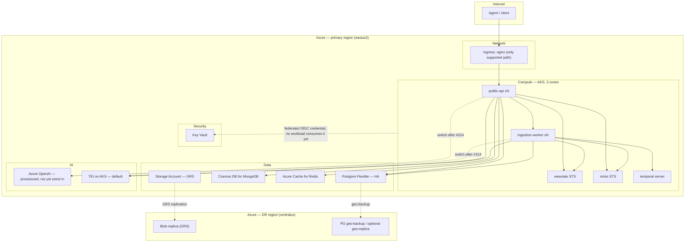
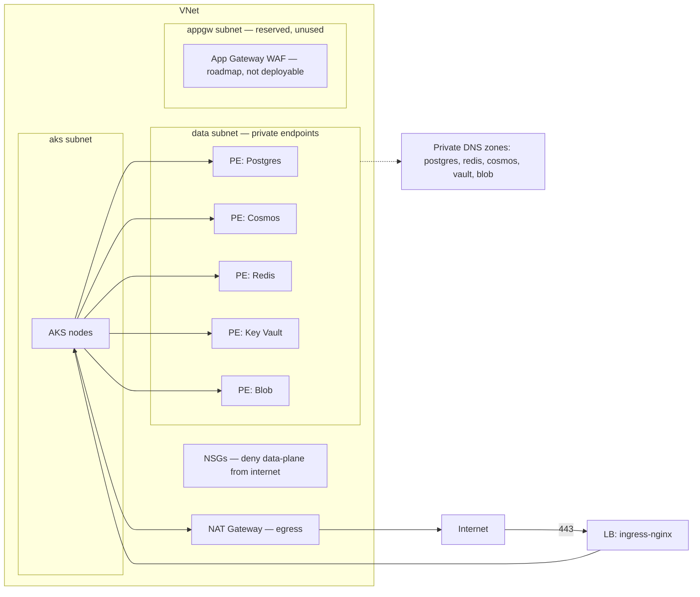
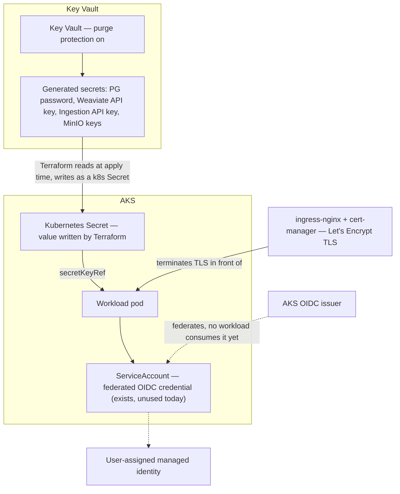
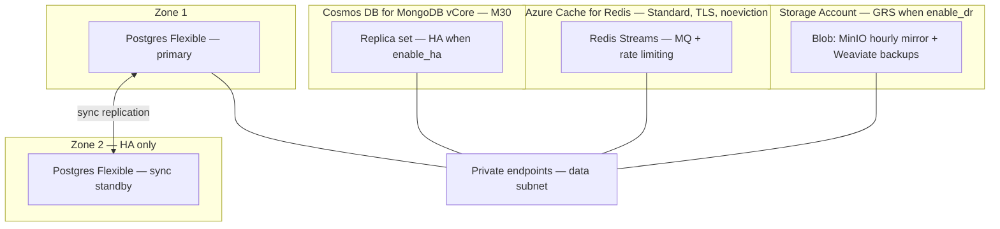
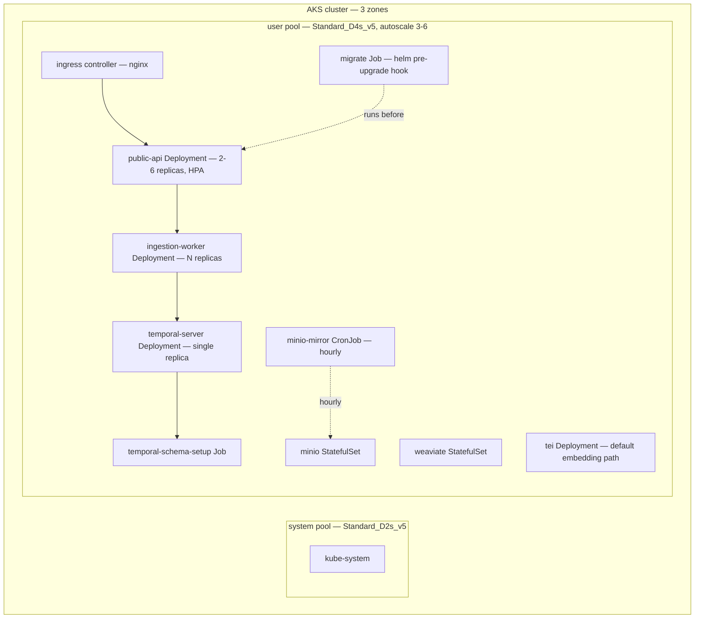
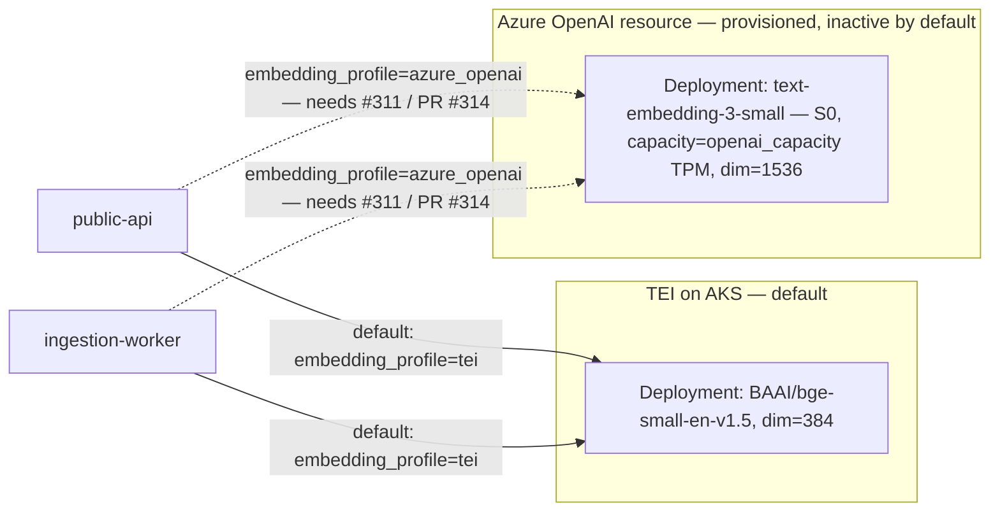

# Deploy to Azure (Production)

Cloud-native production deployment on Azure: AKS, zone-redundant HA, and
restore-based DR. Terraform provisions everything; a one-click script wraps
`terraform apply` plus post-deploy bootstrap. This is the alternative to the
[Hetzner + Terraform](../getting-started/production.md) path for teams that
want a managed-Kubernetes, multi-zone target instead of a single VM.

All infrastructure lives under `infra/azure/`. Nothing here is hosted-only —
every setting maps to a Terraform variable you control.

## 1. What You Get



| Layer | What Terraform creates |
| --- | --- |
| Network | VNet, subnets (aks / data / appgw), NSGs, private DNS zones, NAT gateway |
| Security | Key Vault, a federated OIDC identity (not yet consumed by any workload), generated secrets materialized as Kubernetes Secrets from Terraform state (see the [state-file secret caveat](#7-enterprise-vnet-integration)) |
| Data | Postgres Flexible (HA), Cosmos DB for MongoDB (vCore), Azure Cache for Redis, Storage Account (GRS) |
| Compute | AKS (3 zones, autoscaling pools), all app workloads via one Helm chart |
| AI | Self-hosted TEI on AKS (**default embedding path**) + an Azure OpenAI resource, provisioned but not yet wired to the app — see [§10](#10-limitations-roadmap) |
| Monitoring | Log Analytics workspace, Container/VM insights, alert rules, action group |
| DR (optional, default on) | Secondary-region GRS, geo-backups, restore runbook outputs |

Module source: `infra/azure/modules/{network,security,data,aks,ai,apps,monitoring,dr}`.

## 2. Per-Layer Architecture

### Network



**Required vs optional**

| Component | Required / Optional | Notes |
| --- | --- | --- |
| NAT gateway | Required | Only egress path for AKS nodes unless BYO-VNet supplies its own |
| Private DNS zones | Required when private endpoints are on | Resolve `*.privatelink.*` names inside the VNet |
| Private endpoints | Optional, on by default | `enable_private_endpoints` (default `true`) |
| App Gateway WAF | **Roadmap, not deployable today** | `ingress_profile = "appgw_waf"` is rejected by validation ("not yet supported"); code exists but is unreachable — AGIC wiring tracked as follow-up under [epic #320](https://github.com/inherent-prime/inherent/issues/320). `nginx` is the only supported value and the default |
| Private AKS cluster (no public API server) | Optional | `private_cluster_enabled` (default `false`) |
| Bring-your-own VNet | Optional | `existing_vnet_id` + `existing_subnet_ids`; default `""` creates a new VNet |
| Authorized IP ranges on the AKS API server | Optional | `authorized_ip_ranges`; empty list = no additional restriction beyond public/private mode |

### Security



**Truthfully, today:** secrets are read out of Key Vault by Terraform and
written into the cluster as plain Kubernetes `Secret` objects
(`kubernetes_secret` resources in `modules/apps`), which pods reference via
`secretKeyRef` — the same mechanism the [Hetzner path](../getting-started/production.md)
uses, not a Key Vault CSI mount. A federated OIDC credential (`modules/security`)
now exists on the AKS OIDC issuer, but no workload's ServiceAccount consumes
it yet — see the [state-file secret caveat](#7-enterprise-vnet-integration)
for what that means for secret handling.

**Required vs optional**

| Component | Required / Optional | Notes |
| --- | --- | --- |
| Key Vault + purge protection | Required | Cannot be disabled once turned on; compliance baseline (see [§7](#7-enterprise-vnet-integration)) |
| Federated OIDC identity credential | Provisioned, not yet consumed | No workload authenticates through it today; secrets still flow via Terraform → Kubernetes `Secret` (above) |
| TLS termination (ingress-nginx + cert-manager) | Required | The only supported ingress path; `ingress_profile = "nginx"` (default and only valid value — see [§2 Network](#network) above) |

### Data



**Required vs optional**

| Component | Required / Optional | Notes |
| --- | --- | --- |
| Postgres Flexible zone-redundant HA | Optional, on by default | `enable_ha` (default `true`) |
| Cosmos DB HA replicas | Optional, on by default | Follows `enable_ha`; `cosmos_mongo_sku` fixed to `M30` by default |
| Redis TLS + `noeviction` | Required, non-negotiable | Redis Streams back the durable MQ; eviction silently drops undelivered events (see [production hardening](production.md#5-fix-the-event-queue-eviction-policy)) |
| Storage Account GRS | Optional, on by default | `enable_dr` (default `true`); `false` uses LRS, no cross-region replica |
| Postgres geo-replica | Optional, off by default | `pg_geo_replica` (default `false`) — near-zero-RPO standby in the DR region, roughly doubles PG cost |
| Private endpoints | Optional, on by default | `enable_private_endpoints` (default `true`) |

### Compute



**Required vs optional**

| Component | Required / Optional | Notes |
| --- | --- | --- |
| 3-zone AKS cluster | Required | Zone spread of workloads follows `enable_ha` |
| HPA on `public-api` | Required | `api_replicas_min` / `api_replicas_max` |
| `migrate` Job (helm hook, singleton) | Required | Applies SQL migrations before every upgrade |
| PodDisruptionBudgets + NetworkPolicies | Required | Applied to every workload in `apps/` |
| Private AKS cluster | Optional | `private_cluster_enabled` (default `false`) |
| TEI Deployment (default embedding path) | Required unless `embedding_profile = "azure_openai"` | `embedding_profile = "tei"` is the default (see [AI](#ai) below) |
| `temporal-server` replica count | Fixed at 1, always | Not an HA knob: Temporal's ringpop cluster membership isn't wired through the chart's NetworkPolicy, workflow state already lives durably in Postgres, and AKS reschedules the pod on node loss — a second replica would need ringpop ports opened with no durability benefit |
| Ingress: nginx | Required, only supported value | `ingress_profile = "nginx"`; `appgw_waf` is rejected by validation (roadmap, [§10](#10-limitations-roadmap)) |

### AI



**Default today is `tei`** (self-hosted [Text Embeddings Inference](https://github.com/huggingface/text-embeddings-inference)
on AKS, `BAAI/bge-small-en-v1.5`, `EMBEDDING_DIM=384`), not Azure OpenAI. The
Azure OpenAI resource + `text-embedding-3-small` deployment is still
provisioned by `modules/ai` every apply — so switching later is one tfvar,
not a new `apply` from scratch — but the app cannot speak to it yet:
`embedding_profile = "azure_openai"` needs the `openai_compatible` provider
path ([#311](https://github.com/inherent-prime/inherent/issues/311),
[PR #314](https://github.com/inherent-prime/inherent/pull/314), unmerged).
Until that merges, setting `embedding_profile = "azure_openai"` deploys the
Azure OpenAI resource but the app keeps speaking the TEI wire protocol and
ignores `EMBEDDING_PROVIDER`/`EMBEDDING_API_KEY` — **do not** set it in
production before #314 merges.

**`EMBEDDING_DIM` is not cosmetic.** `tei` = `384`, `azure_openai` =
`openai_embedding_dim` (`1536` by default). Weaviate's vector index is
created at a fixed dimension on first ingest; switching `embedding_profile`
on a workspace that has already ingested documents under the other profile's
dimension does not re-embed anything — searches against the mismatched
dimension fail or silently return nothing sensible. Treat an embedding
profile switch like a schema migration: plan a full re-ingest, don't flip
the tfvar on a live corpus.

**Required vs optional**

| Component | Required / Optional | Notes |
| --- | --- | --- |
| TEI on AKS | Required unless `azure_openai` chosen | `embedding_profile = "tei"` (**default**) — self-hosted, no external quota/cost dependency |
| Azure OpenAI resource + embedding deployment | Always provisioned; **inactive** until #314 merges | `embedding_profile = "azure_openai"` — do not select in production before then |
| `openai_capacity` (TPM units) | Tunable, not optional | Default `50`; only matters once `azure_openai` is selectable — raises the embedding throughput ceiling |

## 3. Prerequisites

**Required**

| Item | Notes |
| --- | --- |
| Azure subscription | With Owner (or an equivalent custom RBAC set: Contributor + User Access Administrator + Key Vault Administrator) on the target resource groups |
| Azure OpenAI access + quota | `modules/ai` provisions the Azure OpenAI resource + `text-embedding-3-small` deployment unconditionally, even though the **default** `embedding_profile = "tei"` doesn't use it yet (see [§2 AI](#ai)) — request access if not yet granted on the subscription, and confirm quota in your target region before applying |
| `terraform` >= 1.9, `az` CLI, `kubectl`, `helm` | Installed locally or in CI |
| `jq`, `curl`, `openssl` | `scripts/deploy-azure.sh` uses all three (parsing `terraform output -json`, the health-gate poll, and generating the bootstrap API key) — its own preflight check fails loudly if any is missing |
| A DNS zone or record you control | For `dns_zone_name` + `dns_record`, or an externally-managed `api_hostname` |
| Private-endpoint mode: `deployer_ip_ranges` | When `enable_private_endpoints` is on (the default), Terraform itself needs to write to Key Vault/Storage from wherever you run `apply` — set `deployer_ip_ranges` to your operator/CI egress CIDRs (see [§7](#7-enterprise-vnet-integration)) |
| ~30 minutes | End-to-end apply time for a fresh prod-HA stack |

**Optional**

| Item | Notes |
| --- | --- |
| `k6` | Only needed for `--loadtest` / `scripts/loadtest/k6-search.js` — [install instructions](https://k6.io/docs/get-started/installation/). A deploy without it fully succeeds; see [§5](#raising-the-ceiling) and [§10](#10-limitations-roadmap) |

**NOT required**

| Item | Why not |
| --- | --- |
| An existing VNet | Only needed for BYO-VNet mode (`existing_vnet_id`); default mode creates one |
| GPU quota | Nothing in this stack requests GPU SKUs (embedding runs on CPU TEI by default, or Azure OpenAI once selectable) |
| Docker installed locally | Terraform and `az`/`kubectl`/`helm` are the only local tools; images are pulled by AKS |
| Any Hetzner account/token | Azure and Hetzner are independent deploy targets — see [Hetzner + Terraform](../getting-started/production.md) for that path |

## 4. One-Click Deploy

`scripts/deploy-azure.sh` wraps the full path: preflight, state bootstrap,
apply, health wait, workspace bootstrap, optional load test. Run it from the
repo root (it resolves `infra/azure` relative to its own location, not your
`cwd`):

```bash
# First run: also creates the remote-state resource group/storage account
./scripts/deploy-azure.sh --bootstrap-state --yes

# Subsequent runs: reuse existing state
./scripts/deploy-azure.sh --yes

# With a post-deploy load test (targeted at 20 QPS / 5m, see #9)
./scripts/deploy-azure.sh --yes --loadtest

# Tear down
./scripts/deploy-azure.sh --destroy
```

**Two-phase apply (every run, not just the first).** The script always runs
`terraform apply -target=module.aks` before the full `apply` — the
helm/kubernetes Terraform providers are configured from `module.aks`'s
outputs (cluster endpoint, CA cert, OIDC issuer), which don't exist yet on a
from-scratch deploy, so a single-pass full apply can't plan the chart/app
resources. This targeted first apply is idempotent (a no-op diff on every
later re-run) and follows the same `--var-file`/`--yes` gating as the full
apply — without `--yes` you review and confirm a plan for each phase.

| Flag | Effect |
| --- | --- |
| `--bootstrap-state` | Creates the resource group, storage account, and container for Terraform remote state, then emits `backend.hcl` |
| `--yes` | Passes `-auto-approve` to `terraform apply` (omit to review the plan interactively) |
| `--loadtest` | Runs `scripts/loadtest/k6-search.js` (targeted at 20 QPS for 5m, p95 < 2s) against the deployed endpoint after health checks pass. Requires `k6` — if it's missing, the deploy still succeeds but the script exits nonzero (you explicitly asked for a load test that didn't run); see the summary's WARN for why |
| `--destroy` | Runs `terraform destroy` against the same state, after confirmation |
| `--var-file <path>` | Terraform var-file to apply/destroy with (defaults to `terraform.tfvars`) |
| `--skip-bootstrap-key` | Skip the post-deploy workspace + API key bootstrap step |

Run `./scripts/deploy-azure.sh --help` (or read the script's `usage()`) for
the authoritative, current flag list.

The script is idempotent: re-running it against existing state converges to
the current tfvars rather than re-creating resources.

### Manual Terraform path

```bash
cd infra/azure
cp terraform.tfvars.example terraform.tfvars   # or envs/prod.tfvars.example
cp backend.hcl.example backend.hcl             # edit: state RG, storage account, container

terraform init -backend-config=backend.hcl

# Phase 1/2: module.aks first -- its outputs configure the helm/kubernetes
# providers that the full plan below needs (see the two-phase apply note
# above). Idempotent -- safe to re-run on every subsequent deploy too.
terraform apply -var-file=terraform.tfvars -target=module.aks

# Phase 2/2: the full stack
terraform plan  -var-file=terraform.tfvars
terraform apply -var-file=terraform.tfvars

# Kubeconfig for the new cluster
az aks get-credentials --resource-group <rg> --name "$(terraform output -raw aks_name)"

# Confirm the API is serving
curl -s "https://$(terraform output -raw api_fqdn)/health"
```

Use `envs/dev.tfvars.example` for a single-zone, HA-off, small-SKU dev
profile, or `envs/prod.tfvars.example` for HA + DR + nginx ingress.

## 5. Tuning & Tweaking

| Variable | Default | What it changes | When to change it |
| --- | --- | --- | --- |
| `location` | `eastus2` | Primary Azure region | Move the primary deployment region |
| `location_dr` | `centralus` | DR region for GRS + geo-backup | Pick a paired region closer to your DR RTO needs |
| `resource_prefix` | `inherent` | Prefix on every resource name | Running more than one stack in the same subscription |
| `environment` | `prod` | Tag value + naming suffix | Distinguish dev/staging/prod resource groups |
| `tags` | `{}` | Azure resource tags | Cost allocation, ownership, compliance tagging |
| `embedding_profile` | `tei` | `tei` (self-hosted, default) or `azure_openai` | `azure_openai` needs [#311 / PR #314](#ai) — do not select it in production before that merges |
| `storage_profile` | `minio` | Storage backend for documents | Only `minio` implemented; `azure_blob` is reserved (rejected by validation) — see [#329](https://github.com/inherent-prime/inherent/issues/329) |
| `ingress_profile` | `nginx` | Only `nginx` is deployable | `appgw_waf` is rejected by validation (roadmap, [epic #320](https://github.com/inherent-prime/inherent/issues/320)) |
| `enable_ha` | `true` | PG zone-redundant, Redis Standard, multi-zone pools | Turn off only for dev/cost-sensitive non-prod |
| `enable_dr` | `true` | GRS storage, mirror CronJob, geo-backups | Turn off if cross-region recovery isn't required |
| `pg_geo_replica` | `false` | Standing PG replica in the DR region | Need near-zero-RPO PG failover instead of restore-based |
| `existing_vnet_id` | `""` | BYO-VNet mode | Enterprise network integration — see [§7](#7-enterprise-vnet-integration) |
| `existing_subnet_ids` | `{}` | Maps `aks`/`data`/`appgw` to existing subnet IDs | Required alongside `existing_vnet_id` |
| `private_cluster_enabled` | `false` | AKS API server has no public endpoint | Compliance requires no public control-plane access |
| `authorized_ip_ranges` | `[]` | CIDR allow-list on the AKS API server | **Empty means no additional restriction** — the API server is reachable from the whole internet (subject to whatever auth the API server itself enforces), not implicitly locked down. `envs/prod.tfvars.example` does not currently set this — treat it as a gap to fill in with your own operator/CI CIDRs before go-live, the same way you must replace the file's other `CHANGE ME` placeholders |
| `enable_private_endpoints` | `true` | Private Link for PG/Cosmos/Redis/KV/Blob | Turn off only in isolated test subscriptions |
| `deployer_ip_ranges` | `[]` | CIDR allow-list Key Vault/Storage firewalls open for Terraform itself | **Required alongside `enable_private_endpoints = true`** — otherwise `terraform apply` cannot reach Key Vault/Storage to write secrets/state from outside the VNet; see [§7](#7-enterprise-vnet-integration) |
| `aks_sku_tier` | `"Standard"` | AKS control-plane SLA tier | `"Free"` removes the control-plane SLA and its ~$73/mo cost — fine for dev/non-prod, not recommended for prod (see [§8 TCO](#8-total-cost-of-ownership-tco)) |
| `log_retention_days` | `30` | Log Analytics workspace retention | Raise for longer audit/incident-investigation windows (raises cost — [§8](#8-total-cost-of-ownership-tco)) |
| `vnet_cidr` | `"10.20.0.0/16"` | Address space of the VNet Terraform creates | Change to avoid overlap when peering to an existing hub/spoke |
| `pod_cidr` | — | AKS Azure CNI overlay pod address space | Change to avoid overlap with `vnet_cidr` or peered networks; also threaded into the chart's NetworkPolicy CIDR excepts |
| `aks_system_vm_size` | `Standard_D2s_v5` | System node pool SKU | Rarely — system pool runs cluster add-ons only |
| `aks_user_vm_size` | `Standard_D4s_v5` | App workload node SKU | Raise for CPU/memory-bound workers or TEI |
| `aks_user_min_count` | `3` | Floor of the user pool autoscaler | Lower for dev; keep ≥3 for prod zone spread |
| `aks_user_max_count` | `6` | Ceiling of the user pool autoscaler | Raise to raise the QPS ceiling (see below) |
| `api_replicas_min` | `2` | HPA floor for `public-api` | Keep ≥2 for zero-downtime rollouts |
| `api_replicas_max` | `6` | HPA ceiling for `public-api` | Raise to raise the QPS ceiling |
| `worker_replicas` | `2` | Ingestion worker replica count | Raise for higher ingestion throughput (safe: Temporal + consumer groups) |
| `pg_sku` | `GP_Standard_D2ds_v5` | Postgres Flexible compute tier | Raise under sustained CPU/IO pressure |
| `pg_storage_mb` | `65536` | Postgres Flexible storage | Raise as document metadata volume grows |
| `cosmos_mongo_sku` | `M30` | Cosmos DB for MongoDB vCore tier | Raise under sustained Mongo load |
| `redis_sku` / `redis_family` / `redis_capacity` | `Standard` / `C` / `1` | Azure Cache for Redis tier/size | Raise capacity to raise the QPS ceiling (rate-limit + Streams throughput) |
| `weaviate_disk_gb` | `64` | Weaviate PVC size | Raise as vector index size grows |
| `minio_disk_gb` | `128` | MinIO PVC size | Raise as document blob volume grows |
| `inherent_version` | pinned release | App image tag | Upgrade the deployed version — never set to `latest` in prod |
| `dns_zone_name` / `dns_record` (or `api_hostname`) | — | Public hostname for the API | Required: point this at your own domain |
| `letsencrypt_email` | — | ACME registration contact | Required (the only supported ingress path is `nginx` + cert-manager) |
| `openai_embedding_model` | `text-embedding-3-small` | Embedding model deployed | Change only if standardizing on a different embedding model, once `azure_openai` is selectable |
| `openai_embedding_dim` | `1536` | Vector dimension used when `embedding_profile = "azure_openai"` | Must match the embedding model; changing it (or switching profiles) requires re-ingesting — see [§2 AI](#ai) |
| `openai_sku` | `S0` | Azure OpenAI pricing tier | Rarely — `S0` is the standard pay-as-you-go tier |
| `openai_capacity` | `50` | Provisioned TPM units | Only matters once `azure_openai` is selectable — raise to raise the embedding throughput ceiling |

### Raising the ceiling

The stack is **targeted** at **20 QPS sustained** (`scripts/loadtest/k6-search.js`,
p95 < 2s) — validated per-deployment by running `--loadtest` yourself, not by
anything in CI (see [§10](#10-limitations-roadmap) for why). To push past that:

1. **`api_replicas_max`** — the HPA won't scale past this even if CPU/memory
   headroom exists. Raise it first.
2. **`aks_user_max_count`** — the cluster autoscaler won't add nodes past this
   even if pods are pending. Raise alongside `api_replicas_max` or the extra
   replicas will stay `Pending`.
3. **`redis_sku` / `redis_capacity`** — rate-limiting and MQ Streams both run
   through Redis; it saturates before Postgres at high QPS. Move from
   `Standard/C/1` toward `Premium` tiers with more throughput headroom.
4. **`pg_sku`** — read/write load on document metadata and `api_keys` lookups;
   raise if PG CPU alerts fire under load (see [monitoring alerts](#9-dr-failure-response)).
5. **`openai_capacity`** — embedding calls throttle at the provisioned TPM
   ceiling; raise if ingestion backs up under sustained load, not search QPS.

Always re-run `--loadtest` after raising any of these — there is no capacity
baseline in this repo beyond the 20 QPS target `scripts/loadtest/k6-search.js`
is written against (see [§10](#10-limitations-roadmap)).

## 6. How to Modify the Terraform

| Want to... | Edit |
| --- | --- |
| Change VNet/subnet/NSG/NAT/private DNS layout | `infra/azure/modules/network/` |
| Change Key Vault, identities, role assignments, generated secrets | `infra/azure/modules/security/` |
| Change PG/Cosmos/Redis/Storage Account sizing or config | `infra/azure/modules/data/` |
| Change AKS node pools, autoscaler, CNI, OIDC, private cluster | `infra/azure/modules/aks/` |
| Change the Azure OpenAI resource or embedding deployment | `infra/azure/modules/ai/` |
| Change any app workload (Helm values, replica counts, probes, ingress) | `infra/azure/modules/apps/` and `charts/inherent/values.yaml` |
| Change alert thresholds or Log Analytics retention | `infra/azure/modules/monitoring/` |
| Change DR behavior (secondary storage, PG geo-replica, restore outputs) | `infra/azure/modules/dr/` |
| Add or change a root variable | `infra/azure/variables.tf`, wire it through `main.tf` |
| Change what a module returns to others | `infra/azure/modules/<module>/outputs.tf` — see the [cross-module interface](#cross-module-interface) below |

### Cross-module interface

Modules communicate only through explicit outputs — never reach into another
module's resources directly:

| Module | Key outputs |
| --- | --- |
| `network` | `vnet_id`, `subnet_ids{aks,data,appgw}`, `private_dns_zone_ids{postgres,redis,cosmos,vault,blob}` |
| `security` | `key_vault_id`/`uri`, `workload_identity_client_id`, generated secret names |
| `data` | `pg_fqdn`, `pg_admin_user`, `pg_password_kv_secret`, `cosmos_connection_string_kv_secret`, `redis_hostname`, `redis_url_kv_secret`, `storage_account_name` |
| `aks` | `cluster_name`/`id`, `oidc_issuer`, `node_resource_group`, `log_analytics_id` |
| `ai` | `openai_endpoint`, `embedding_deployment_name`, `key_kv_secret`, `dim` |

### Worked example: change the Postgres SKU

```hcl
# terraform.tfvars
pg_sku = "GP_Standard_D4ds_v5"   # up from GP_Standard_D2ds_v5
```

```bash
terraform plan  -var-file=terraform.tfvars
terraform apply -var-file=terraform.tfvars
```

A Postgres Flexible Server SKU change is applied in place; Azure schedules a
brief restart. On an HA-enabled server, the standby is resized first and
promoted, so client impact is a single failover blip, not a hard outage. Apply
during a low-traffic window regardless.

### Worked example: bring your own VNet

```hcl
# terraform.tfvars
existing_vnet_id = "/subscriptions/<sub-id>/resourceGroups/<rg>/providers/Microsoft.Network/virtualNetworks/<vnet-name>"
existing_subnet_ids = {
  aks    = "/subscriptions/<sub-id>/.../subnets/aks"
  data   = "/subscriptions/<sub-id>/.../subnets/data"
  appgw  = "/subscriptions/<sub-id>/.../subnets/appgw"
}
private_cluster_enabled = true
```

The `network` module skips VNet/subnet creation and wires every downstream
module (AKS, private endpoints, App Gateway) to the IDs you supplied instead.
Your subnets must have room for the AKS node pool's max size (`aks_user_max_count`
+ `aks_system_vm_size` pool) and must not overlap the CIDRs of anything else
you peer to this VNet.

### Roadmap: App Gateway WAF ingress

`ingress_profile = "appgw_waf"` is **not deployable today** — Terraform's
own validation rejects it ("not yet supported"). The `azurerm_application_gateway`
and AGIC code paths exist in `modules/apps/ingress.tf` and `modules/aks`, but
`main.tf` hardcodes the App Gateway id both modules need to `null`, so AGIC
is never actually installed and nothing would route traffic to it even if
the validation didn't reject the value first. `nginx` + cert-manager is the
only ingress path you can apply. Follow-up work to finish the AGIC wiring is
tracked under [epic #320](https://github.com/inherent-prime/inherent/issues/320);
once it lands, switching will change the public ingress IP (`dns_record`
would need re-pointing) and add roughly $300/mo over nginx (see
[§8](#8-total-cost-of-ownership-tco), kept there as a roadmap cost note).

## 7. Enterprise VNet Integration

| Capability | Variable(s) | Notes |
| --- | --- | --- |
| Bring your own VNet | `existing_vnet_id`, `existing_subnet_ids` | Terraform creates nothing at the network layer; it wires into what you provide |
| Private AKS API server | `private_cluster_enabled` | No public control-plane endpoint; `kubectl` needs network line-of-sight (VPN/ExpressRoute/jumpbox) |
| Private endpoints for all data services | `enable_private_endpoints` (default `true`) | PG, Cosmos, Redis, Key Vault, and Blob are reachable only from the VNet |
| Terraform's own access when private endpoints are on | `deployer_ip_ranges` | **Required whenever `enable_private_endpoints = true`** (the default): Key Vault/Storage firewalls otherwise block `apply` itself from writing secrets/state if you run Terraform from outside the VNet. Set it to your operator/CI egress CIDRs; empty (`[]`) is only safe when Terraform runs from inside the VNet (e.g. a self-hosted runner) |
| Restrict AKS API server access | `authorized_ip_ranges` | CIDR allow-list; empty means no additional restriction (see [§5](#5-tuning-tweaking)). Combine with `private_cluster_enabled = false` for a public-but-restricted endpoint |
| Controlled egress | NAT gateway (network module) | All outbound AKS traffic (image pulls, Azure OpenAI calls) egresses through one set of static IPs — allow-list these on any downstream firewall |
| VNet peering to existing hub/spoke | Not a Terraform variable | Peer the VNet Terraform creates (or the one you bring) to your hub after apply, via your existing peering process |

**State-file secret caveat.** Generated secrets (PG password, API keys, MinIO
keys) are written into Terraform state as resource attributes, exactly like
the [Hetzner path](../getting-started/production.md#setting-application-secrets)
documents. `sensitive = true` only redacts CLI output — the values are in
plaintext in `terraform.tfstate`. Lock down the state storage account:

- Use a dedicated storage account for state, not a general-purpose one.
- Disable public blob access; restrict access to your CI identity and break-glass operators only via RBAC (`Storage Blob Data Contributor` scoped to the container).
- Enable blob versioning and soft delete on the state container.
- Never commit `*.tfstate` or `backend.hcl` (with real values) to git.

**Key Vault purge protection** is enabled unconditionally by the `security`
module and cannot be turned off once set — this is deliberate: it prevents a
compromised or mistaken `terraform destroy` from permanently destroying
secrets before their retention window expires.

**Compliance notes**

- TLS on every PaaS connection and on public ingress: Redis via `rediss://`
  (port 6380), Postgres requires SSL, Cosmos via `mongodb+srv`, Azure OpenAI
  over HTTPS, and ingress terminates TLS (Let's Encrypt via cert-manager).
  This does **not** extend to every in-cluster hop: pod-to-pod traffic
  between the app and weaviate/minio/temporal is plain HTTP inside the AKS
  pod network today, guarded by NetworkPolicy (default-deny plus explicit
  allow rules) and the VNet boundary rather than by transport encryption.
  In-cluster TLS for those hops is a tracked hardening follow-up, not yet
  implemented.
- Every datastore is private-endpoint-only by default; nothing but the
  ingress controller and the Ingestion API's ClusterIP surface is reachable
  from outside its subnet, and the Ingestion API itself is never on the
  ingress.
- `authorized_ip_ranges` and `private_cluster_enabled` are independent knobs
  — use both for defense in depth on the AKS control plane.
- The app connects to Postgres as the server admin role today (there is no
  least-privilege application-scoped PG role yet) — a known limitation
  tracked as a follow-up under [epic #320](https://github.com/inherent-prime/inherent/issues/320),
  same as the AGIC and in-cluster TLS follow-ups above.

## 8. Total Cost of Ownership (TCO)

All figures are **Azure list-price estimates for `eastus2`**, rounded, and
assume no reserved-instance or enterprise-agreement discounts. **Verify
against the [Azure Pricing Calculator](https://azure.microsoft.com/en-us/pricing/calculator/)
before budgeting** — actuals vary by negotiated discount, exact usage, and
region.

### Dev profile (`envs/dev.tfvars.example`: single-zone, small SKUs, HA off)

| Item | Est. monthly USD |
| --- | --- |
| AKS control plane (`aks_sku_tier = "Standard"` — `envs/dev.tfvars.example`'s own default) | $73 |
| AKS nodes — 1× system + 1× user, `Standard_D2s_v5` | $140 |
| Postgres Flexible — burstable, no HA | $60 |
| Cosmos DB for MongoDB — smallest tier, no HA | $90 |
| Azure Cache for Redis — Basic C0 | $16 |
| Ingress (nginx + LB) | $25 |
| Log Analytics — 14-day retention (`log_retention_days = 14` in the dev example) | $30 |
| Storage (MinIO disk + Blob, LRS, no DR mirror) | $20 |
| Embeddings — self-hosted TEI on the AKS node above (`embedding_profile = "tei"`, the dev example's default) | $0 (no separate resource cost) |
| **Total** | **≈ $454/mo** |

Set `aks_sku_tier = "Free"` to drop the $73 control-plane line (no SLA —
fine for a throwaway dev/eval stack, not recommended once anyone depends on
uptime): **≈ $381/mo** with that override.

### Prod-HA profile (`envs/prod.tfvars.example` with `enable_dr = false`)

| Item | Est. monthly USD |
| --- | --- |
| AKS Standard tier (SLA) | $73 |
| AKS user pool — 3× `Standard_D4s_v5` | $420 |
| AKS system pool — 3× `Standard_D2s_v5` | $210 |
| Postgres Flexible — `D2ds_v5`, zone-redundant HA | $250 |
| Cosmos DB for MongoDB — M30, HA | $370 |
| Azure Cache for Redis — Standard C1 | $102 |
| Ingress — nginx + LB | $25 |
| Log Analytics | $50–150 |
| Storage/backup/egress | $50–100 |
| Embeddings — self-hosted TEI on the AKS pools above (`embedding_profile = "tei"`, the prod example's default) | $0 (no separate resource cost; the Azure OpenAI resource is still provisioned per [§2 AI](#ai) but idle until #314 merges) |
| **Total (nginx ingress — the only deployable path today)** | **≈ $1.55k–1.7k/mo** |
| **Roadmap: AppGW WAF ingress** | **≈ $1.85k–2.0k/mo** (+$300 delta) — kept as a cost-planning reference only; `ingress_profile = "appgw_waf"` is rejected by validation until [epic #320](https://github.com/inherent-prime/inherent/issues/320)'s follow-up lands (see [§6](#6-how-to-modify-the-terraform)) |

### Prod-HA+DR profile (`envs/prod.tfvars.example`, default: `enable_dr = true`)

| Item | Est. monthly USD |
| --- | --- |
| Everything in Prod-HA above | $1.55k–1.7k |
| GRS storage premium (vs LRS) + PG geo-backup storage | $30–50 |
| **Total (nginx ingress)** | **≈ $1.6k–1.75k/mo** |

Enabling `pg_geo_replica = true` (off by default) adds a standing PG replica
in the DR region — roughly **+$250–300/mo** on top of the table above, only
worth it if restore-based PG recovery (see [§9](#9-dr-failure-response)) doesn't meet your RPO.

**Cost levers**

| Lever | Effect |
| --- | --- |
| `aks_sku_tier`: `"Standard"` vs `"Free"` | $73/mo delta (control-plane SLA) |
| `ingress_profile`: `nginx` (only deployable value) vs the roadmapped `appgw_waf` | ~$300/mo delta once AppGW WAF ships |
| `aks_user_vm_size` / `aks_user_max_count` | Largest single cost driver at scale |
| `cosmos_mongo_sku` | M30 → larger tiers scale non-linearly |
| `log_retention_days` (monitoring module) | $50–150/mo swing on retention days alone |
| `enable_ha` | Removes PG standby + Cosmos HA replicas + multi-zone pools when off |
| `enable_dr` | Removes GRS premium + geo-backup when off |
| `pg_geo_replica` | +$250–300/mo when on |
| `embedding_profile`: `tei` (default, self-hosted) vs `azure_openai` (not yet selectable) | TEI's cost is folded into the AKS node pool already sized above; `azure_openai` adds provisioned-TPM cost on top once selectable |

## 9. DR & Failure Response

| Target | Value |
| --- | --- |
| RPO (database tier, restore-based DR) | ≤ 1 hour |
| RTO (restore-based DR) | ≤ 4 hours |

Zone loss is handled automatically (PG standby failover, AKS reschedules
pods). Region loss and accidental data deletion are restore-based and require
running the runbook. Full failure-mode table, exact restore commands, and the
quarterly DR-drill checklist: **[Azure DR Runbook](azure-dr-runbook.md)**.

Object storage's DR floor is bounded by the `minio-mirror` CronJob
schedule — hourly by default, which keeps object-storage RPO within the
system's ≤ 1 h target. Tighten it further if you need a smaller window;
see the runbook for the resolved detail.

## 10. Limitations & Roadmap

| Limitation | Detail | Tracking |
| --- | --- | --- |
| MinIO required, not native Blob | The app implements only `s3`-compatible and `local` storage backends; `storage_profile = "azure_blob"` is a reserved enum value rejected by validation | [#329](https://github.com/inherent-prime/inherent/issues/329) |
| `embedding_profile = "azure_openai"` not yet usable | Depends on the `openai_compatible` provider path; until it merges, `azure_openai` deploys the Azure OpenAI resource but the app still speaks TEI's wire protocol and ignores `EMBEDDING_PROVIDER`/`EMBEDDING_API_KEY`. `tei` (self-hosted, CPU) is the **default** and the only working profile today — see [§2 AI](#ai) | [#311](https://github.com/inherent-prime/inherent/issues/311), [PR #314](https://github.com/inherent-prime/inherent/pull/314) |
| `ingress_profile = "appgw_waf"` not yet deployable | Rejected by validation; `nginx` + cert-manager is the only supported ingress path — see [§6](#6-how-to-modify-the-terraform) | [epic #320](https://github.com/inherent-prime/inherent/issues/320) |
| No capacity baseline beyond the 20 QPS target | `scripts/loadtest/k6-search.js` is written against a 20 QPS / p95 < 2s target, but nothing in this repo validates a live deployment against it automatically — the CI workflow (`azure-terraform.yml`) is validate-only and never touches a real cluster, by design (see its own header comment). A deployment is "targeted at 20 QPS", not "load-test-validated at 20 QPS", until you run `--loadtest` (or the k6 script directly) against it yourself, and again after any tuning change in [§5](#5-tuning-tweaking) | — |
| Single-region serving | Only one region serves traffic at a time; DR is restore-based (RPO ≤ 1h / RTO ≤ 4h), not active-active | See [Azure DR Runbook](azure-dr-runbook.md) |
| No in-cluster TLS | weaviate/minio/temporal/api pod-to-pod traffic is plaintext, guarded by NetworkPolicy + the VNet boundary, not encryption — see [§7 compliance notes](#7-enterprise-vnet-integration) | — |
| App connects to Postgres as the server admin | No least-privilege, application-scoped PG role exists yet | [epic #320](https://github.com/inherent-prime/inherent/issues/320) |
| `TRUSTED_PROXIES` does exact-IP matching, not CIDR | The app's trusted-proxy check can't express the ingress controller's pod CIDR as a range; per-client rate limiting behind ingress is a known limitation until the app gains CIDR support | — |

## See Also

- [Azure DR Runbook](azure-dr-runbook.md) — failure modes, restore procedures, DR drills
- [Taking Inherent to Production](production.md) — hardening steps that apply to every deployment target
- [Deploy to Production (Hetzner)](../getting-started/production.md) — single-VM alternative
