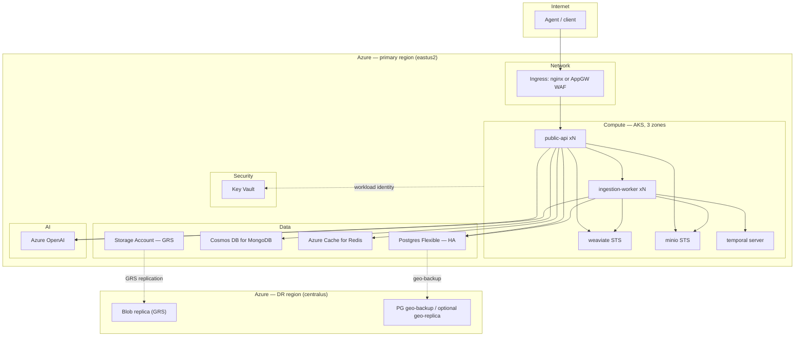
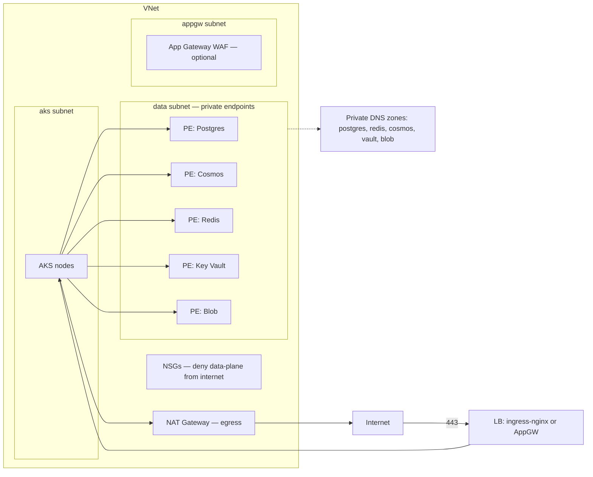
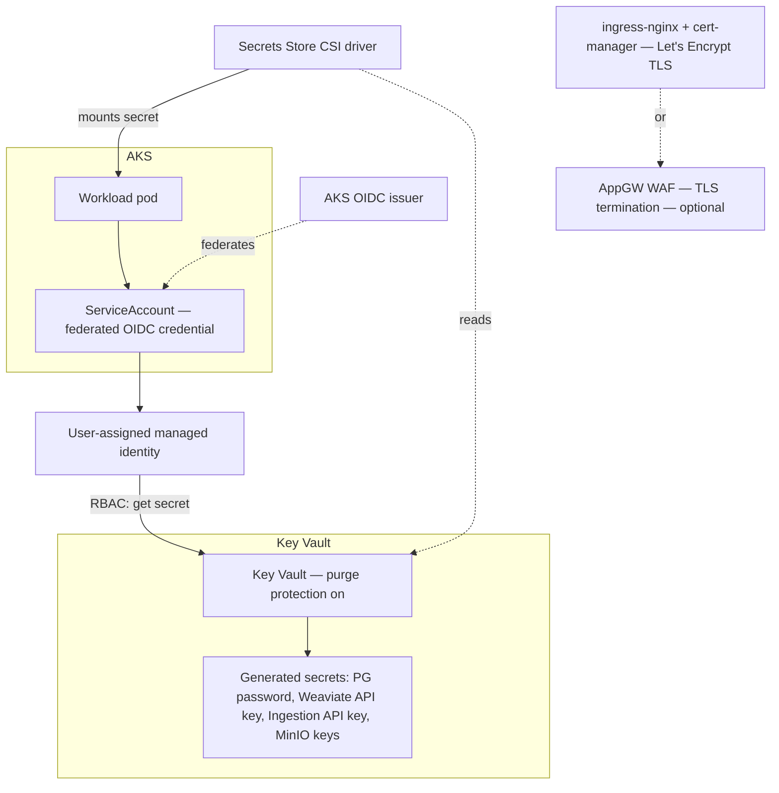
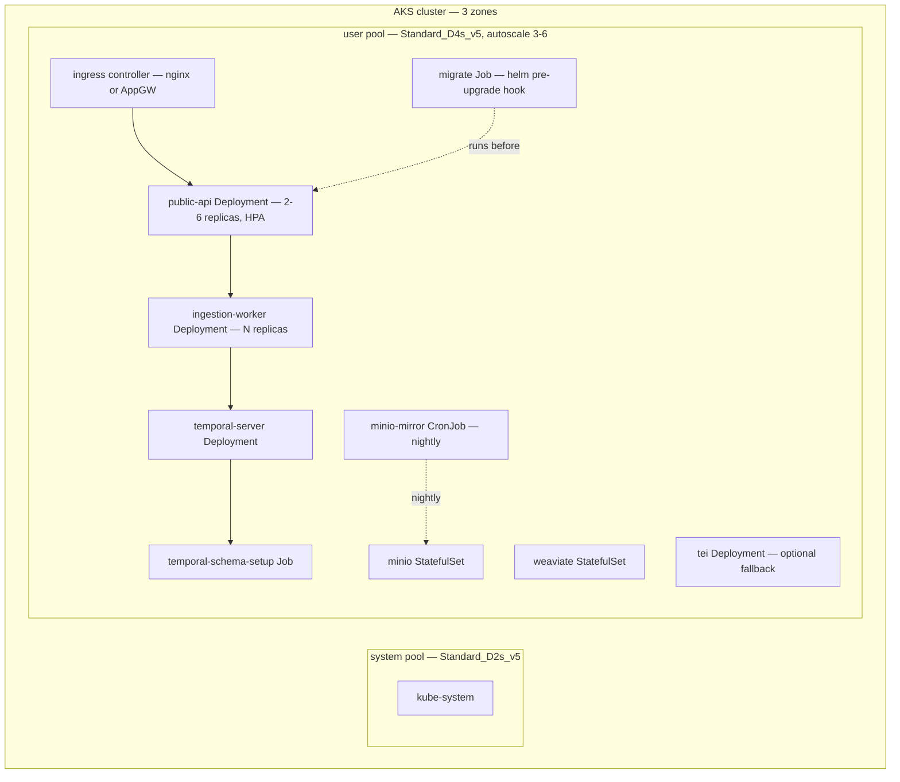
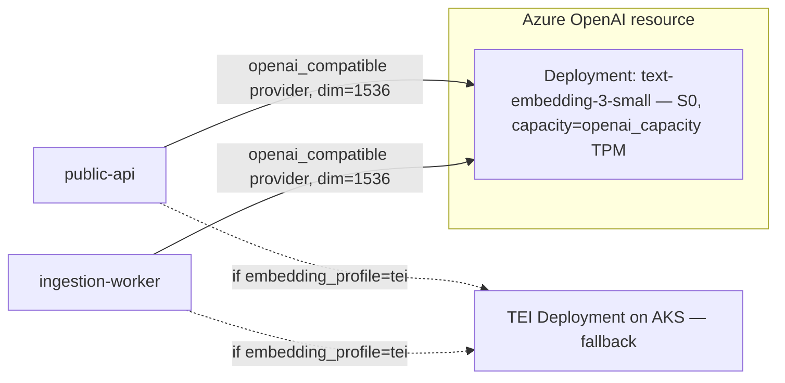

# Deploy to Azure (Production)

Cloud-native production deployment on Azure: AKS, zone-redundant HA, and
restore-based DR. Terraform provisions everything; a one-click script wraps
`terraform apply` plus post-deploy bootstrap. This is the alternative to the
[Hetzner + Terraform](../getting-started/production.md) path for teams that
want a managed-Kubernetes, multi-zone target instead of a single VM.

All infrastructure lives under `infra/azure/`. Nothing here is hosted-only —
every setting maps to a Terraform variable you control.

## 1. What You Get



| Layer | What Terraform creates |
| --- | --- |
| Network | VNet, subnets (aks / data / appgw), NSGs, private DNS zones, NAT gateway |
| Security | Key Vault, workload identity, generated secrets, CSI secrets driver |
| Data | Postgres Flexible (HA), Cosmos DB for MongoDB (vCore), Azure Cache for Redis, Storage Account (GRS) |
| Compute | AKS (3 zones, autoscaling pools), all app workloads via one Helm chart |
| AI | Azure OpenAI resource + embedding deployment |
| Monitoring | Log Analytics workspace, Container/VM insights, alert rules, action group |
| DR (optional, default on) | Secondary-region GRS, geo-backups, restore runbook outputs |

Module source: `infra/azure/modules/{network,security,data,aks,ai,apps,monitoring,dr}`.

## 2. Per-Layer Architecture

### Network



**Required vs optional**

| Component | Required / Optional | Notes |
| --- | --- | --- |
| NAT gateway | Required | Only egress path for AKS nodes unless BYO-VNet supplies its own |
| Private DNS zones | Required when private endpoints are on | Resolve `*.privatelink.*` names inside the VNet |
| Private endpoints | Optional, on by default | `enable_private_endpoints` (default `true`) |
| App Gateway WAF | Optional | `ingress_profile = "appgw_waf"`; default is `nginx` |
| Private AKS cluster (no public API server) | Optional | `private_cluster_enabled` (default `false`) |
| Bring-your-own VNet | Optional | `existing_vnet_id` + `existing_subnet_ids`; default `""` creates a new VNet |
| Authorized IP ranges on the AKS API server | Optional | `authorized_ip_ranges`; empty list = no additional restriction beyond public/private mode |

### Security



**Required vs optional**

| Component | Required / Optional | Notes |
| --- | --- | --- |
| Key Vault + purge protection | Required | Cannot be disabled once turned on; compliance baseline (see [§7](#7-enterprise-vnet-integration)) |
| Workload identity (OIDC federation) | Required | No client secrets on pods; identity scoped per workload |
| CSI secrets driver | Required | Mounts Key Vault secrets as files/env into pods |
| TLS termination (nginx + cert-manager) | Required unless AppGW WAF chosen | Default path, `ingress_profile = "nginx"` |
| AppGW WAF TLS termination | Optional | `ingress_profile = "appgw_waf"` — adds WAF rules, ~$300/mo delta (see [§8](#8-total-cost-of-ownership-tco)) |

### Data


**Required vs optional**

| Component | Required / Optional | Notes |
| --- | --- | --- |
| Postgres Flexible zone-redundant HA | Optional, on by default | `enable_ha` (default `true`) |
| Cosmos DB HA replicas | Optional, on by default | Follows `enable_ha`; `cosmos_mongo_sku` fixed to `M30` by default |
| Redis TLS + `noeviction` | Required, non-negotiable | Redis Streams back the durable MQ; eviction silently drops undelivered events (see [production hardening](production.md#5-fix-the-event-queue-eviction-policy)) |
| Storage Account GRS | Optional, on by default | `enable_dr` (default `true`); `false` uses LRS, no cross-region replica |
| Postgres geo-replica | Optional, off by default | `pg_geo_replica` (default `false`) — near-zero-RPO standby in the DR region, roughly doubles PG cost |
| Private endpoints | Optional, on by default | `enable_private_endpoints` (default `true`) |

### Compute



**Required vs optional**

| Component | Required / Optional | Notes |
| --- | --- | --- |
| 3-zone AKS cluster | Required | Zone spread of workloads follows `enable_ha` |
| HPA on `public-api` | Required | `api_replicas_min` / `api_replicas_max` |
| `migrate` Job (helm hook, singleton) | Required | Applies SQL migrations before every upgrade |
| PodDisruptionBudgets + NetworkPolicies | Required | Applied to every workload in `apps/` |
| Private AKS cluster | Optional | `private_cluster_enabled` (default `false`) |
| TEI Deployment (embedding fallback) | Optional | `embedding_profile = "tei"` |
| Ingress: nginx vs AppGW WAF | Required (one of the two) | Choice via `ingress_profile` |

### AI



Both services set `EMBEDDING_PROVIDER=openai_compatible`,
`EMBEDDING_SERVICE_URL=https://<resource>.openai.azure.com/openai`,
`EMBEDDING_MODEL_ID=<deployment name>`, `EMBEDDING_DIM=1536`. The API key comes
from Key Vault via the CSI driver, never a tfvar.

**Required vs optional**

| Component | Required / Optional | Notes |
| --- | --- | --- |
| Azure OpenAI resource + embedding deployment | Required unless TEI fallback chosen | `embedding_profile = "azure_openai"` (default) |
| TEI fallback | Optional | `embedding_profile = "tei"` — use until [PR #314](https://github.com/inherent-prime/inherent/pull/314) merges (see [§10](#10-limitations-roadmap)) |
| `openai_capacity` (TPM units) | Tunable, not optional | Default `50`; raise to raise the embedding throughput ceiling |

## 3. Prerequisites

**Required**

| Item | Notes |
| --- | --- |
| Azure subscription | With Owner (or an equivalent custom RBAC set: Contributor + User Access Administrator + Key Vault Administrator) on the target resource groups |
| Azure OpenAI access + quota | Request access if not yet granted on the subscription; confirm `text-embedding-3-small` quota in your target region before applying |
| `terraform` >= 1.9, `az` CLI, `kubectl`, `helm` | Installed locally or in CI |
| A DNS zone or record you control | For `dns_zone_name` + `dns_record`, or an externally-managed `api_hostname` |
| ~30 minutes | End-to-end apply time for a fresh prod-HA stack |

**NOT required**

| Item | Why not |
| --- | --- |
| An existing VNet | Only needed for BYO-VNet mode (`existing_vnet_id`); default mode creates one |
| GPU quota | Nothing in this stack requests GPU SKUs (embedding runs on Azure OpenAI or CPU TEI) |
| Docker installed locally | Terraform and `az`/`kubectl`/`helm` are the only local tools; images are pulled by AKS |
| Any Hetzner account/token | Azure and Hetzner are independent deploy targets — see [Hetzner + Terraform](../getting-started/production.md) for that path |

## 4. One-Click Deploy

`scripts/deploy-azure.sh` wraps the full path: preflight, state bootstrap,
apply, health wait, workspace bootstrap, optional load test.

```bash
cd infra/azure

# First run: also creates the remote-state resource group/storage account
./scripts/deploy-azure.sh --bootstrap-state --yes

# Subsequent runs: reuse existing state
./scripts/deploy-azure.sh --yes

# With a post-deploy load test (20 QPS / 5m, see #9)
./scripts/deploy-azure.sh --yes --loadtest

# Tear down
./scripts/deploy-azure.sh --destroy
```

| Flag | Effect |
| --- | --- |
| `--bootstrap-state` | Creates the resource group, storage account, and container for Terraform remote state, then emits `backend.hcl` |
| `--yes` | Passes `-auto-approve` to `terraform apply` (omit to review the plan interactively) |
| `--loadtest` | Runs `scripts/loadtest/k6-search.js` (20 QPS for 5m, p95 < 2s) against the deployed endpoint after health checks pass |
| `--destroy` | Runs `terraform destroy` against the same state, after confirmation |
| `--var-file <path>` | Terraform var-file to apply/destroy with (defaults to `terraform.tfvars`) |
| `--skip-bootstrap-key` | Skip the post-deploy workspace + API key bootstrap step |

Run `./scripts/deploy-azure.sh --help` (or read the script's `usage()`) for
the authoritative, current flag list.

The script is idempotent: re-running it against existing state converges to
the current tfvars rather than re-creating resources.

### Manual Terraform path

```bash
cd infra/azure
cp terraform.tfvars.example terraform.tfvars   # or envs/prod.tfvars.example
cp backend.hcl.example backend.hcl             # edit: state RG, storage account, container

terraform init -backend-config=backend.hcl
terraform plan  -var-file=terraform.tfvars
terraform apply -var-file=terraform.tfvars

# Kubeconfig for the new cluster
az aks get-credentials --resource-group <rg> --name "$(terraform output -raw aks_name)"

# Confirm the API is serving
curl -s "https://$(terraform output -raw api_fqdn)/health"
```

Use `envs/dev.tfvars.example` for a single-zone, HA-off, small-SKU dev
profile, or `envs/prod.tfvars.example` for HA + DR + WAF ingress.

## 5. Tuning & Tweaking

| Variable | Default | What it changes | When to change it |
| --- | --- | --- | --- |
| `location` | `eastus2` | Primary Azure region | Move the primary deployment region |
| `location_dr` | `centralus` | DR region for GRS + geo-backup | Pick a paired region closer to your DR RTO needs |
| `resource_prefix` | `inherent` | Prefix on every resource name | Running more than one stack in the same subscription |
| `environment` | `prod` | Tag value + naming suffix | Distinguish dev/staging/prod resource groups |
| `tags` | `{}` | Azure resource tags | Cost allocation, ownership, compliance tagging |
| `deployment_profile` | `production` | Selects `dev` or `production` variable presets | Non-prod experimentation |
| `embedding_profile` | `azure_openai` | `azure_openai` or `tei` | Switch to CPU TEI fallback (no Azure OpenAI access yet) |
| `storage_profile` | `minio` | Storage backend for documents | Only `minio` implemented; `azure_blob` is reserved (rejected by validation) — see [#329](https://github.com/inherent-prime/inherent/issues/329) |
| `ingress_profile` | `nginx` | `nginx` or `appgw_waf` | Need a managed WAF in front of the API |
| `enable_ha` | `true` | PG zone-redundant, Redis Standard, multi-zone pools | Turn off only for dev/cost-sensitive non-prod |
| `enable_dr` | `true` | GRS storage, mirror CronJob, geo-backups | Turn off if cross-region recovery isn't required |
| `pg_geo_replica` | `false` | Standing PG replica in the DR region | Need near-zero-RPO PG failover instead of restore-based |
| `existing_vnet_id` | `""` | BYO-VNet mode | Enterprise network integration — see [§7](#7-enterprise-vnet-integration) |
| `existing_subnet_ids` | `{}` | Maps `aks`/`data`/`appgw` to existing subnet IDs | Required alongside `existing_vnet_id` |
| `private_cluster_enabled` | `false` | AKS API server has no public endpoint | Compliance requires no public control-plane access |
| `authorized_ip_ranges` | `[]` | CIDR allow-list on the AKS API server | Restrict `kubectl` access to known egress IPs |
| `enable_private_endpoints` | `true` | Private Link for PG/Cosmos/Redis/KV/Blob | Turn off only in isolated test subscriptions |
| `aks_system_vm_size` | `Standard_D2s_v5` | System node pool SKU | Rarely — system pool runs cluster add-ons only |
| `aks_user_vm_size` | `Standard_D4s_v5` | App workload node SKU | Raise for CPU/memory-bound workers or TEI |
| `aks_user_min_count` | `3` | Floor of the user pool autoscaler | Lower for dev; keep ≥3 for prod zone spread |
| `aks_user_max_count` | `6` | Ceiling of the user pool autoscaler | Raise to raise the QPS ceiling (see below) |
| `api_replicas_min` | `2` | HPA floor for `public-api` | Keep ≥2 for zero-downtime rollouts |
| `api_replicas_max` | `6` | HPA ceiling for `public-api` | Raise to raise the QPS ceiling |
| `worker_replicas` | `2` | Ingestion worker replica count | Raise for higher ingestion throughput (safe: Temporal + consumer groups) |
| `pg_sku` | `GP_Standard_D2ds_v5` | Postgres Flexible compute tier | Raise under sustained CPU/IO pressure |
| `pg_storage_mb` | `65536` | Postgres Flexible storage | Raise as document metadata volume grows |
| `cosmos_mongo_sku` | `M30` | Cosmos DB for MongoDB vCore tier | Raise under sustained Mongo load |
| `redis_sku` / `redis_family` / `redis_capacity` | `Standard` / `C` / `1` | Azure Cache for Redis tier/size | Raise capacity to raise the QPS ceiling (rate-limit + Streams throughput) |
| `weaviate_disk_gb` | `64` | Weaviate PVC size | Raise as vector index size grows |
| `minio_disk_gb` | `128` | MinIO PVC size | Raise as document blob volume grows |
| `inherent_version` | pinned release | App image tag | Upgrade the deployed version — never set to `latest` in prod |
| `dns_zone_name` / `dns_record` (or `api_hostname`) | — | Public hostname for the API | Required: point this at your own domain |
| `letsencrypt_email` | — | ACME registration contact | Required when `ingress_profile = "nginx"` |
| `openai_embedding_model` | `text-embedding-3-small` | Embedding model deployed | Change only if standardizing on a different embedding model |
| `openai_embedding_dim` | `1536` | Vector dimension | Must match the embedding model; changing it requires re-ingesting |
| `openai_sku` | `S0` | Azure OpenAI pricing tier | Rarely — `S0` is the standard pay-as-you-go tier |
| `openai_capacity` | `50` | Provisioned TPM units | Raise to raise the embedding throughput ceiling |

### Raising the ceiling

The stack is load-test-validated at **20 QPS sustained** (`scripts/loadtest/k6-search.js`,
p95 < 2s — see [§9](#9-dr-failure-response)). To push past that:

1. **`api_replicas_max`** — the HPA won't scale past this even if CPU/memory
   headroom exists. Raise it first.
2. **`aks_user_max_count`** — the cluster autoscaler won't add nodes past this
   even if pods are pending. Raise alongside `api_replicas_max` or the extra
   replicas will stay `Pending`.
3. **`redis_sku` / `redis_capacity`** — rate-limiting and MQ Streams both run
   through Redis; it saturates before Postgres at high QPS. Move from
   `Standard/C/1` toward `Premium` tiers with more throughput headroom.
4. **`pg_sku`** — read/write load on document metadata and `api_keys` lookups;
   raise if PG CPU alerts fire under load (see [monitoring alerts](#9-dr-failure-response)).
5. **`openai_capacity`** — embedding calls throttle at the provisioned TPM
   ceiling; raise if ingestion backs up under sustained load, not search QPS.

Always re-run `--loadtest` after raising any of these — there is no capacity
baseline in this repo beyond the validated 20 QPS target (see [§10](#10-limitations-roadmap)).

## 6. How to Modify the Terraform

| Want to... | Edit |
| --- | --- |
| Change VNet/subnet/NSG/NAT/private DNS layout | `infra/azure/modules/network/` |
| Change Key Vault, identities, role assignments, generated secrets | `infra/azure/modules/security/` |
| Change PG/Cosmos/Redis/Storage Account sizing or config | `infra/azure/modules/data/` |
| Change AKS node pools, autoscaler, CNI, OIDC, private cluster | `infra/azure/modules/aks/` |
| Change the Azure OpenAI resource or embedding deployment | `infra/azure/modules/ai/` |
| Change any app workload (Helm values, replica counts, probes, ingress) | `infra/azure/modules/apps/` and `charts/inherent/values.yaml` |
| Change alert thresholds or Log Analytics retention | `infra/azure/modules/monitoring/` |
| Change DR behavior (secondary storage, PG geo-replica, restore outputs) | `infra/azure/modules/dr/` |
| Add or change a root variable | `infra/azure/variables.tf`, wire it through `main.tf` |
| Change what a module returns to others | `infra/azure/modules/<module>/outputs.tf` — see the [cross-module interface](#cross-module-interface) below |

### Cross-module interface

Modules communicate only through explicit outputs — never reach into another
module's resources directly:

| Module | Key outputs |
| --- | --- |
| `network` | `vnet_id`, `subnet_ids{aks,data,appgw}`, `private_dns_zone_ids{postgres,redis,cosmos,vault,blob}` |
| `security` | `key_vault_id`/`uri`, `workload_identity_client_id`, generated secret names |
| `data` | `pg_fqdn`, `pg_admin_user`, `pg_password_kv_secret`, `cosmos_connection_string_kv_secret`, `redis_hostname`, `redis_url_kv_secret`, `storage_account_name` |
| `aks` | `cluster_name`/`id`, `oidc_issuer`, `node_resource_group`, `log_analytics_id` |
| `ai` | `openai_endpoint`, `embedding_deployment_name`, `key_kv_secret`, `dim` |

### Worked example: change the Postgres SKU

```hcl
# terraform.tfvars
pg_sku = "GP_Standard_D4ds_v5"   # up from GP_Standard_D2ds_v5
```

```bash
terraform plan  -var-file=terraform.tfvars
terraform apply -var-file=terraform.tfvars
```

A Postgres Flexible Server SKU change is applied in place; Azure schedules a
brief restart. On an HA-enabled server, the standby is resized first and
promoted, so client impact is a single failover blip, not a hard outage. Apply
during a low-traffic window regardless.

### Worked example: bring your own VNet

```hcl
# terraform.tfvars
existing_vnet_id = "/subscriptions/<sub-id>/resourceGroups/<rg>/providers/Microsoft.Network/virtualNetworks/<vnet-name>"
existing_subnet_ids = {
  aks    = "/subscriptions/<sub-id>/.../subnets/aks"
  data   = "/subscriptions/<sub-id>/.../subnets/data"
  appgw  = "/subscriptions/<sub-id>/.../subnets/appgw"
}
private_cluster_enabled = true
```

The `network` module skips VNet/subnet creation and wires every downstream
module (AKS, private endpoints, App Gateway) to the IDs you supplied instead.
Your subnets must have room for the AKS node pool's max size (`aks_user_max_count`
+ `aks_system_vm_size` pool) and must not overlap the CIDRs of anything else
you peer to this VNet.

### Worked example: switch to App Gateway WAF ingress

```hcl
# terraform.tfvars
ingress_profile = "appgw_waf"
```

```bash
terraform plan  -var-file=terraform.tfvars
terraform apply -var-file=terraform.tfvars
```

This replaces the `nginx` + `cert-manager` ingress path with an
`azurerm_application_gateway` in WAF_v2 mode. The public ingress IP changes —
re-point `dns_record` at the new IP after apply (`terraform output`) before
relying on the new endpoint. Adds roughly $300/mo over nginx (see [§8](#8-total-cost-of-ownership-tco)).

## 7. Enterprise VNet Integration

| Capability | Variable(s) | Notes |
| --- | --- | --- |
| Bring your own VNet | `existing_vnet_id`, `existing_subnet_ids` | Terraform creates nothing at the network layer; it wires into what you provide |
| Private AKS API server | `private_cluster_enabled` | No public control-plane endpoint; `kubectl` needs network line-of-sight (VPN/ExpressRoute/jumpbox) |
| Private endpoints for all data services | `enable_private_endpoints` (default `true`) | PG, Cosmos, Redis, Key Vault, and Blob are reachable only from the VNet |
| Restrict AKS API server access | `authorized_ip_ranges` | CIDR allow-list; combine with `private_cluster_enabled = false` for a public-but-restricted endpoint |
| Controlled egress | NAT gateway (network module) | All outbound AKS traffic (image pulls, Azure OpenAI calls) egresses through one set of static IPs — allow-list these on any downstream firewall |
| VNet peering to existing hub/spoke | Not a Terraform variable | Peer the VNet Terraform creates (or the one you bring) to your hub after apply, via your existing peering process |

**State-file secret caveat.** Generated secrets (PG password, API keys, MinIO
keys) are written into Terraform state as resource attributes, exactly like
the [Hetzner path](../getting-started/production.md#setting-application-secrets)
documents. `sensitive = true` only redacts CLI output — the values are in
plaintext in `terraform.tfstate`. Lock down the state storage account:

- Use a dedicated storage account for state, not a general-purpose one.
- Disable public blob access; restrict access to your CI identity and break-glass operators only via RBAC (`Storage Blob Data Contributor` scoped to the container).
- Enable blob versioning and soft delete on the state container.
- Never commit `*.tfstate` or `backend.hcl` (with real values) to git.

**Key Vault purge protection** is enabled unconditionally by the `security`
module and cannot be turned off once set — this is deliberate: it prevents a
compromised or mistaken `terraform destroy` from permanently destroying
secrets before their retention window expires.

**Compliance notes**

- TLS everywhere: Redis via `rediss://` (port 6380), Postgres requires SSL,
  Cosmos via `mongodb+srv`, ingress terminates TLS (Let's Encrypt or AppGW
  WAF) — no plaintext data-plane traffic crosses the VNet boundary.
- Every datastore is private-endpoint-only by default; nothing but the
  ingress controller and the Ingestion API's ClusterIP surface is reachable
  from outside its subnet, and the Ingestion API itself is never on the
  ingress.
- `authorized_ip_ranges` and `private_cluster_enabled` are independent knobs
  — use both for defense in depth on the AKS control plane.

## 8. Total Cost of Ownership (TCO)

All figures are **Azure list-price estimates for `eastus2`**, rounded, and
assume no reserved-instance or enterprise-agreement discounts. **Verify
against the [Azure Pricing Calculator](https://azure.microsoft.com/en-us/pricing/calculator/)
before budgeting** — actuals vary by negotiated discount, exact usage, and
region.

### Dev profile (`envs/dev.tfvars.example`: single-zone, small SKUs, HA off)

| Item | Est. monthly USD |
| --- | --- |
| AKS control plane (Free tier) | $0 |
| AKS nodes — 1× system + 1× user, `Standard_D2s_v5` | $140 |
| Postgres Flexible — burstable, no HA | $60 |
| Cosmos DB for MongoDB — smallest tier, no HA | $90 |
| Azure Cache for Redis — Basic C0 | $16 |
| Ingress (nginx + LB) | $25 |
| Log Analytics — short retention | $30 |
| Storage (MinIO disk + Blob, LRS, no DR mirror) | $20 |
| Azure OpenAI embeddings | $5 |
| **Total** | **≈ $386/mo** |

### Prod-HA profile (`envs/prod.tfvars.example` with `enable_dr = false`)

| Item | Est. monthly USD |
| --- | --- |
| AKS Standard tier (SLA) | $73 |
| AKS user pool — 3× `Standard_D4s_v5` | $420 |
| AKS system pool — 3× `Standard_D2s_v5` | $210 |
| Postgres Flexible — `D2ds_v5`, zone-redundant HA | $250 |
| Cosmos DB for MongoDB — M30, HA | $370 |
| Azure Cache for Redis — Standard C1 | $102 |
| Ingress — nginx + LB | $25 |
| Log Analytics | $50–150 |
| Storage/backup/egress | $50–100 |
| Azure OpenAI embeddings | $5 (negligible at 20 QPS) |
| **Total (nginx ingress)** | **≈ $1.55k–1.7k/mo** |
| **Total (AppGW WAF ingress instead)** | **≈ $1.85k–2.0k/mo** (+$300 for `ingress_profile = "appgw_waf"`) |

### Prod-HA+DR profile (`envs/prod.tfvars.example`, default: `enable_dr = true`)

| Item | Est. monthly USD |
| --- | --- |
| Everything in Prod-HA above | $1.55k–1.7k |
| GRS storage premium (vs LRS) + PG geo-backup storage | $30–50 |
| **Total (nginx ingress)** | **≈ $1.6k–1.75k/mo** |

Enabling `pg_geo_replica = true` (off by default) adds a standing PG replica
in the DR region — roughly **+$250–300/mo** on top of the table above, only
worth it if restore-based PG recovery (see [§9](#9-dr-failure-response)) doesn't meet your RPO.

**Cost levers**

| Lever | Effect |
| --- | --- |
| `ingress_profile`: `nginx` vs `appgw_waf` | ~$300/mo delta |
| `aks_user_vm_size` / `aks_user_max_count` | Largest single cost driver at scale |
| `cosmos_mongo_sku` | M30 → larger tiers scale non-linearly |
| Log Analytics retention (monitoring module) | $50–150/mo swing on retention days alone |
| `enable_ha` | Removes PG standby + Cosmos HA replicas + multi-zone pools when off |
| `enable_dr` | Removes GRS premium + geo-backup when off |
| `pg_geo_replica` | +$250–300/mo when on |

## 9. DR & Failure Response

| Target | Value |
| --- | --- |
| RPO (database tier, restore-based DR) | ≤ 1 hour |
| RTO (restore-based DR) | ≤ 4 hours |

Zone loss is handled automatically (PG standby failover, AKS reschedules
pods). Region loss and accidental data deletion are restore-based and require
running the runbook. Full failure-mode table, exact restore commands, and the
quarterly DR-drill checklist: **[Azure DR Runbook](azure-dr-runbook.md)**.

Object storage's actual DR floor is bounded by the `minio-mirror` CronJob
schedule (nightly by default) — tighten the schedule if you need object
storage RPO under 24h; see the runbook for the resolved detail.

## 10. Limitations & Roadmap

| Limitation | Detail | Tracking |
| --- | --- | --- |
| MinIO required, not native Blob | The app implements only `s3`-compatible and `local` storage backends; `storage_profile = "azure_blob"` is a reserved enum value rejected by validation | [#329](https://github.com/inherent-prime/inherent/issues/329) |
| Embedding provider dependency | `embedding_profile = "azure_openai"` depends on the `openai_compatible` provider path; until that path is merged, use `embedding_profile = "tei"` (CPU TEI on AKS) as a fallback | [#311](https://github.com/inherent-prime/inherent/issues/311), [PR #314](https://github.com/inherent-prime/inherent/pull/314) |
| No capacity baseline beyond 20 QPS | The repo has no load-test history above the validated `scripts/loadtest/k6-search.js` target (20 QPS, p95 < 2s). Run `--loadtest` (or the k6 script directly) against your own traffic shape before go-live, and again after any tuning change in [§5](#5-tuning-tweaking) | — |
| Single-region serving | Only one region serves traffic at a time; DR is restore-based (RPO ≤ 1h / RTO ≤ 4h), not active-active | See [Azure DR Runbook](azure-dr-runbook.md) |

## See Also

- [Azure DR Runbook](azure-dr-runbook.md) — failure modes, restore procedures, DR drills
- [Taking Inherent to Production](production.md) — hardening steps that apply to every deployment target
- [Deploy to Production (Hetzner)](../getting-started/production.md) — single-VM alternative
